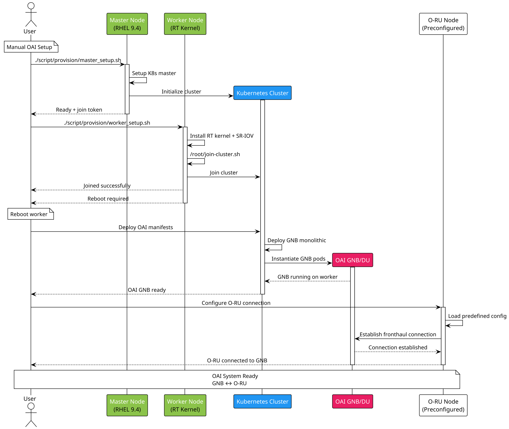
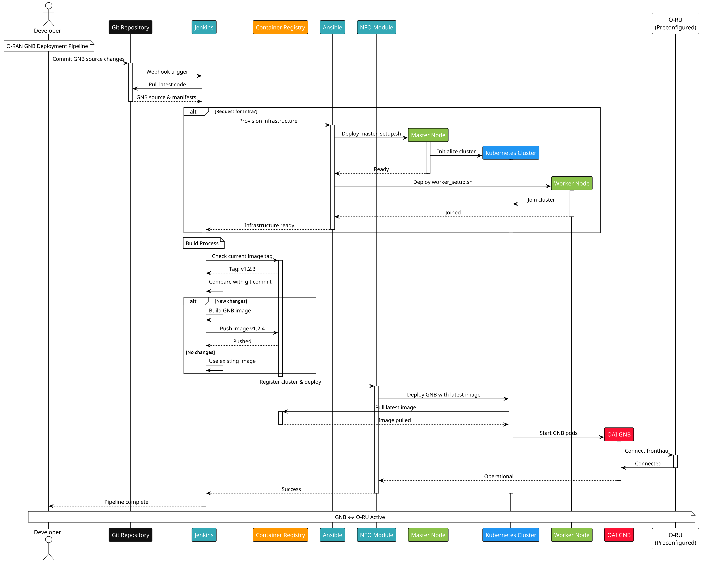

<h1 align="center">Installation Guideline - OAI FH 7.2 on Vanilla Kubernetes</h1>
<hr>


## Project description

**Project Name:** OAI FH 7.2 on Vanilla Kubernetes

**Description:** Automated Deployment and Management of GNB Software on Cloud Environment

**Key Features:**

- C-RAN Integration with O-Ru

**Target Users:** [Developers/Researchers/System Administrators/etc.]

> [!CAUTION]
> Make this document private by default. Only make it public after publishing the project.
>
> Request access with the GitHub admin in our group.

> [!NOTE]
> **Purpose of Installation Guide:**
> This guide focuses on setup, configuration, and getting the system running on your local environment or target deployment system.

> ## Table of Contents
> * [Remote Access Methods](#remote-access-methods)
>     * [SSH](#ssh)
> * [Action Items](#action-items)
>     * [User Provisioned](#user-provisioned)
>     * [CICD Provisioned Infra](#cicd-provisioned-infra)
> * [System Architecture](#system-architecture)
> * [Minimum Specification Requirements](#minimum-specification-requirements)
>     * [Master Node](#master-node)
>     * [Worker Node](#worker-node)
> * [Installation Process](#installation-process)
>     * [Repository Structure](#repository-structure)
>     * [Master Node Setup](#master-node-setup)
>     * [Worker Node Setup](#worker-node-setup)
> * [Table of Paramaters](#table-of-paramaters)
>     * [Inputs Parameters](#inputs-parameters)
>     * [`master_setup.sh`](#master_setupsh)
>     * [`worker_setup.sh`](#worker_setupsh)
> * [Message Sequence Chart (MSC)](#message-sequence-chart-msc)
>     * [Human Provisioned Sequence](#human-provisioned-sequence)
>     * [CICD Pipeline Setup](#cicd-pipeline-setup)
> * [Post-Installation Verification](#post-installation-verification)
> * [Troubleshooting](#troubleshooting)
>     * [Common Issues and Solutions](#common-issues-and-solutions)
> * [Additional Resources](#additional-resources)


## Remote Access Methods

### SSH

```shell
ssh bmw@192.168.8.75
```

## Action Items

Write your installation/integration plan & status in here:

### User Provisioned

| Step                                                   | Command/Action                                               | Description                                                                                     | Status             |
| ----------------------------                           | ------------------------------------------------------------ | --------------------------------------------------                                              | ------             |
| Check Server Support for SRIOV and NUMA                | Human Intervention                                           | Google this up., based on your machine.                                                         | :white_check_mark: |
| Configure BIOS for SRIOV and NUMA                      | Human Intervention                                           | Google this up., based on your machine.                                                         | :white_check_mark: |
| Install OS for Kubernetes Master Node                  | Human Intervention                                           | Install RHEL 9.4                                                                                | :white_check_mark: |
| Install OS for Kubernetes Worker Node                  | Human Intervention                                           | Install RHEL 9.4                                                                                | :white_check_mark: |
| Setup Master Node                                      | run script `provision/master_setup.sh` on master Node        | Turn this node into master node and install necessary components for O-Cloud Operation          | :white_check_mark: |
| Setup Worker Node for RT Workload                      | run script `provision/worker_setup.sh` on worker Node        | Turn this node into worker node and adjust the kernel into RT                                   | :white_check_mark: |
| Build and Publish OAI 7.2 Image                        | run script `deployment/build_image.sh`                       | You can run this from any machine with internet connection                                      | :white_check_mark: |
| [Deploy OAI RFSim](./docs/testing-deploy-oai-rfsim.md) | Human Intervention, Follow the guide                         | Deploy Chart of OAI GNB                                                                         | :white_check_mark: |
| Deploy OAI 7.2 Chart                                   | run script `deployment/deploy_test.sh`                       | Deploy Chart of OAI GNB                                                                         | :white_check_mark: |
| Integrate OAI with O-RU                                | Human Intervention                                           | Update the configmap parameters based on the connected O-RU                                     | :white_check_mark: |
| Integrate OAI with Core Network                        | Human Intervention                                           | Update the values.yaml based on the network plan (PLMN, N2 & N3 Connection)                     | :white_check_mark: |
| End-to-end integration with COTS UE                    | Humen Intervention                                           | Register UE to CN that conncected to GNB<br>*Current Status: UE got relese after PDU requests.* | :warning:          |

### CICD Provisioned Infra

> [!WARNING]
> **TBD**
> This implementation will proceed after the user provisioned setup is finished.
> Will migrate note from Notion


## System Architecture


**Important Components to Include in System Architecture (O-RAN O-DU Architecture Pattern):**

1. **Master Node**
   1. Cilium CNI
   2. Multus CNI
   3. Multus Plugin SRIOV
   3. OpenEBS
2. **Worker Node**
   1. RT Kernel
   2. SRIOV Enabled


## Minimum Specification Requirements

### Master Node

| Component        | Requirement                            |
| ---------------- | -------------------------------------- |
| Operating System | Red Hat Enterprise Linux 9.0 or Higher |
| CPU              | 2 GHz, 8-core                          |
| Memory           | 16 GB RAM                              |
| Kubernetes       | 1.28 or higher                         |
| CRI-O            | 1.28 or higher                         |


### Worker Node

| Component        | Requirement                            |
| ---------------- | -------------------------------------- |
| Operating System | Red Hat Enterprise Linux 9.0 or Higher |
| CPU              | 2 GHz, 16-core                          |
| Memory           | 32 GB RAM                              |
| Kubernetes       | 1.28 or higher                         |
| CRI-O            | 1.28 or higher                         |
| HW Motherboard   | Support NUMA                           |
| HW NIC           | Support SRIOV                          |


## Installation Process

### Repository Structure

```
.
├── docs
│   └── USER-GUIDE.md
├── LICENSE
├── README.md
├── scripts
│   ├── deployment
│   └── provision
│       ├── master_setup.sh
│       └── worker_setup.sh
└── src
```

### Master Node Setup

1. SSH into node machine

2. Git Clone this Repo and Check the script

   ```bash
   git clone https://github.com/bmw-ece-ntust/nino-c-ran-installation.git
   cd nino-c-ran-installation/
   ./scripts/provision/master_setup.sh --help
   ```

3. Provision the system using the `master_setup.sh`

   ```
   ./scripts/provision/k8s-setup.sh \
     --runtime crio
     --api-address 192.168.8.XXX \
     --pod-network 10.42.0.0/16 \
     --service-network 10.43.0.0/16 \
     --multi-node
   ```

4. Script details

   ```
   Usage: scripts/provision/master_setup.sh [OPTIONS]
   Options:
     --api-address IP       API server advertise address (default: auto-detect)
     --pod-network CIDR     Pod network CIDR (default: 10.244.0.0/16)
     --service-network CIDR Service network CIDR (default: 10.96.0.0/12)
     --runtime crio|containerd Container runtime (default: crio)
     --multi-node          Setup multi-node cluster (keeps taints)
     --rollback            Remove all Kubernetes components
     --help                Show this help

   Examples:
     scripts/provision/master_setup.sh --api-address 192.168.1.100
     scripts/provision/master_setup.sh --runtime containerd --multi-node
     scripts/provision/master_setup.sh --rollback
   ```


### Worker Node Setup

1. Make sure SRIOV and CPU virtualization is already enabled from BIOS/BMC

2. SSH into node machine

3. Git clone this repo to the worker node

4. Setup the machine as a worker node, you need to have the join-token and join-hash from master node before hand

   1. Run the following command on master node to get the join-token and join-hash

      ```bash
      kubeadm token create --print-join-command
      # Example output
      # kubeadm join 192.168.8.114:6443 --token cl76in.xyfjn0w1vyhub1pa --discovery-token-ca-cert-hash sha256:754e8c8c8dad70dcc24cc06642003f57f9e804714eeb1cdd5f7081a8b2c265d0
      ```

   2. Enable RT kernel package on the RedHat subscription-manager

      ```
      sudo subscription-manager repos --enable rhel-9-for-x86_64-rt-rpms
      ```

   3. Run the worker_setup.sh script to provision your system as `root`

      You will ned to have redhat-activation-key and organization id first for `rh_activation_key` and `rh-org-id`.
      > [!NOTE] [Creating and managing activatio keys](https://docs.redhat.com/en/documentation/subscription_central/1-latest/html/getting_started_with_activation_keys_on_the_hybrid_cloud_console/assembly-creating-managing-activation-keys)

      Examples:
      - housekeeping_cpus: 6
      - hugepage_count: 40
      - hugepage_size: "1G"
      - crio_version: "1.31"
      - k8s_version: "1.31"
      - auto_reboot: true
      - rollback: false

      Get `join-token` and `join-hash` from `scripts/ansible/playbooks/kubeconfig/join-params.yml` for latest cluster

      ```
      # Example based on my current setup
      ./script/provision/worker_setup.sh \
        --master-ip {{ master_ip }} \
        --join-token {{ join_token }} \
        --join-hash {{ join_hash }} \
        --rh-org-id {{ rh_org_id }} \
        --rh-activation-key {{ rh_activation_key }} \
        --housekeeping-cpus {{ housekeeping_cpus }} \
        --hugepage-count {{ hugepage_count }} \
        --hugepage-size {{ hugepage_size }} \
        --crio-version {{ crio_version }} \
        --k8s-version {{ k8s_version }}

      ```

5. Script Full functions

   ```
   Usage: ./scripts/provision/worker_setup.sh [OPTIONS]
   Options:
     --master-ip IP         Kubernetes master node IP (required for join)
     --join-token TOKEN     Kubernetes join token (required for join)
     --join-hash HASH       CA cert hash (required for join)
     --hugepage-size SIZE   Hugepage size: 2M or 1G (default: 1G)
     --hugepage-count NUM   Number of hugepages (default: 8)
     --runtime crio|containerd Container runtime (default: crio)
     --disable-rt           Skip RT kernel installation
     --disable-sriov        Skip SR-IOV configuration
     --disable-vfio         Skip VFIO configuration
     --rollback             Remove Kubernetes worker components only
     --rollback-rt          Full rollback including RT kernel
     --help                 Show this help

   Examples:
     ./scripts/provision/worker_setup.sh --master-ip 192.168.1.100 --join-token abc123... --join-hash sha256:def456...
     ./scripts/provision/worker_setup.sh --hugepage-size 2M --hugepage-count 1024 --disable-rt
     ./scripts/provision/worker_setup.sh --rollback-rt

   To get join parameters from master, run on master:
     kubeadm token create --print-join-command

   ```


##

## Table of Paramaters


### Inputs Parameters

### `master_setup.sh`

| Parameter Name                  | Example Value                   | Description                                                         |
| ------------------------------- | ---------------------------------------------- | ----------------------------------------------------------------------------------- |
| `--multi-node` | N/A | Enable Multi Node Cluster setup mode, keep master taints. Without this flag the cluster will allow deployment of non kube-system on the master node. |
| `--runtime` | `crio` | Pick container engine for the cluster for now support containerd or crio |
| `--pod-network` | `10.8.0.0/16` | Define the subnet for Pods across cluster, make sure your environment are not using this subnet otherwise there might be conflicts when you want to connect the Pods to your network. |
| `--service-network` | `10.32.0.0/12` | Define the subnet for Services across cluster, make sure your environment are not using this subnet otherwise there might be conflicts when you want to connect the Pods to your network. |
| `--api-address` | `192.168.8.100/24` | Endpoint of the kubernetes API (:6443) this should be accessible by the other nodes of this cluster in order for them to join the cluster. Pick the IP on the interface where its reachable by your nodes. |
| `--rollback` | N/A | This flag will remove all of the kubernetes related changes on your system and turn it into generic Linux System. |


### `worker_setup.sh`

| Parameter Name   | Example Value                                   | Description                                                  |
| ---------------- | ----------------------------------------------- | ------------------------------------------------------------ |
| --master-ip      | 192.168.8.100                                   |                                                              |
| --join-token     | abc123.xyz789def456                             | Derive from the master node, run `kubeadm token create --print-join-command` if you didn't save it from the previous installation |
| --join-hash      | sha256:fedcba0987654321fedcba0987654321fedcba09 | Derive from the master node, run `kubeadm token create --print-join-command` if you didn't save it from the previous installation |
| --hugepage-size  | 2M                                              | Define Hugepage Size, `2M` or `1G`                           |
| --hugepage-count | 1024                                            | Define how many hugepages (Allocate this based on your memory) |
| --runtime        | crio                                            | Pick container engine for the cluster for now support containerd or crio |
| --disable-rt     | N/A                                             | Skip RT kernel mode setup                                    |
| --disable-sriov  | N/A                                             | Skip SRIOV setup                                             |
| --rollback       | N/A                                             | Remove all kubernetes related changes on system              |
| --rollback-rt    | N/A                                             | Remove all RT related changes on system                      |


## Message Sequence Chart (MSC)

### Human Provisioned Sequence




### CICD Pipeline Setup




## Post-Installation Verification

Follow these steps to verify your installation was successful:

1. **Check Application Status:**

   ```bash
   # Check if the application is running
   ps aux | grep app.py
   ```

   **Expected Result:** You should see the process running with PID and resource usage information.
2. **Test Basic Functionality:**

   ```bash
   # Test API endpoint (if applicable)
   curl http://localhost:3000/health
   ```

   **Expected Result:** Response should return `{"status": "OK", "timestamp": "..."}` or similar.
3. **Verify Database Connection:**

   ```bash
   # Run database connectivity test
   python3 -c "from src.main import test_db_connection; test_db_connection()"
   ```

   **Expected Result:** Output should confirm successful database connection.


## Troubleshooting

### Common Issues and Solutions

1. **Issue: Port already in use**

   **Error Message:** `Address already in use: 3000`

   **Solution:**

   ```bash
   # Find process using the port
   sudo lsof -i :3000-
   # Kill the process (replace PID with actual process ID)
   kill -9 <PID>
   ```
2. **Issue: Python dependencies not found**

   **Error Message:** `ModuleNotFoundError: No module named 'module_name'`

   **Solution:**

   ```bash
   # Reinstall dependencies
   pip install -r requirements.txt
   # Or install specific package
   pip install module_name
   ```
3. **Issue: Permission denied errors**

   **Error Message:** `Permission denied: '/path/to/file'`

   **Solution:**

   ```bash
   # Fix file permissions
   chmod 755 /path/to/file
   # Or run with appropriate user permissions
   sudo python3 app.py
   ```

## Additional Resources

**Documentation:**

- [Official Project Documentation](https://your-project-docs.com)
- [API Reference Guide](https://your-project-api.com)
- [Configuration Reference](https://your-project-config.com)

**Community Support:**

- [GitHub Issues](https://github.com/your-username/your-repo/issues)
- [Stack Overflow Tag](https://stackoverflow.com/questions/tagged/your-project)
- [Discord Community](https://discord.gg/your-project)

**Contact:**

- **Maintainer:** Your Name (<your.email@example.com>)
- **Support Team:** <support@your-project.com>
- **Emergency Contact:** +1-xxx-xxx-xxxx (for critical issues only)

---

> [!NOTE]
> This installation guide is regularly updated. For the latest version, check the [GitHub repository](https://github.com/your-username/your-repo).
