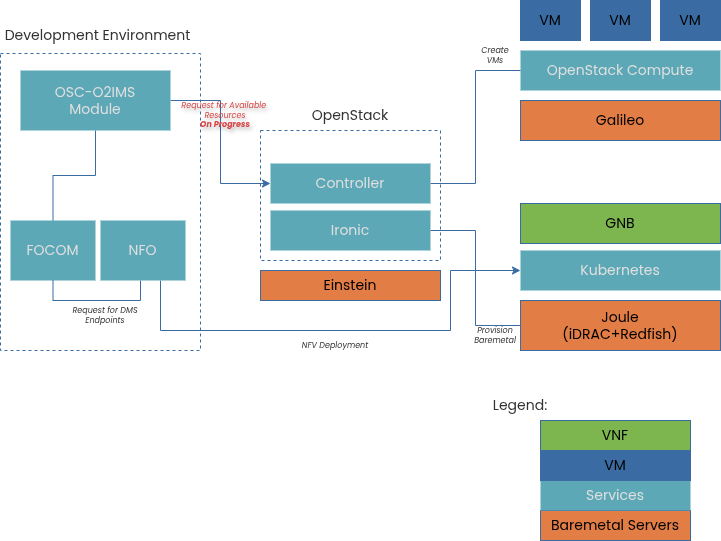

# OpenStack Deployment for O2 IMS Testing



## Objective
Deploy minimal OpenStack on RHEL 9 for OSC PTI O2 IMS testing and bare metal provisioning via Redfish.

---

## Deployment Progress Tracker

| Task | Status |
|------|--------|
| [Install Centos 9 on controller VM](#11-controller-vm-setup) | ✅ Complete |
| [Install Centos 9 on bare metal compute](#12-compute-node-setup) | ✅ Complete |
| [Configure Podman + compatibility layer](#13-container-runtime) | ✅ Complete |
| [Setup SSH keys and passwordless sudo](#14-access-configuration) | ✅ Complete |
| [Create Python venv and install Kolla](#21-python-environment) | ✅ Complete |
| [Configure inventory and host_vars](#22-inventory-configuration) | ✅ Complete |
| [Configure globals.yml](#23-global-configuration) | ✅ Complete |
| [Download Ironic deploy images](#24-ironic-images) | ✅ Complete |
| [Generate passwords](#31-password-generation) | ✅ Complete |
| [Bootstrap servers](#32-bootstrap) | ✅ Complete |
| [Run prechecks](#33-prechecks) | ✅ Complete |
| [Deploy full stack](#34-deployment) | ✅ Complete |
| [Post-deploy configuration](#35-post-deploy) | ✅ Complete |
| [Install OpenStack CLI](#41-cli-installation) | ✅ Complete |
| [Integrate OSC IMS Module with OpenStack](#41-cli-installation) | N/A |
| [Integrate OSC IMS Module with BMW FOCOM and NFO](#41-cli-installation) | N/A |
---

## 1. Infrastructure Setup

### 1.1 Controller VM Setup
- **Node**: 192.168.8.51
- **OS**: Centos 9
- **Resources**: 8GB RAM, 40GB disk
- **Status**: ✅ Complete

**Network Configuration**:
- Interface: enp1s0 (192.168.8.51/24)
- External: enp8s0 (for Neutron, no IP)

### 1.2 Compute Node Setup
- **Node**: 192.168.8.35
- **OS**: Centos 9
- **Resources**: Available for hypervisor
- **Status**: ✅ Complete

**Network Configuration**:
- Interface: ens3 (192.168.8.35/24)
- Note: Single interface configuration

### 1.3 Container Runtime
```bash
# Install Podman compatibility layer
sudo dnf install -y podman-docker
sudo systemctl enable --now podman.socket

# Install Python bindings (system-wide for Ansible)
sudo pip3 install podman
```

### 1.4 Access Configuration
```bash
# SSH keys
ssh-keygen -t rsa
ssh-copy-id root@192.168.8.35

# Passwordless sudo
echo "$USER ALL=(ALL) NOPASSWD:ALL" | sudo tee /etc/sudoers.d/$USER
```

---

## 2. Kolla-Ansible Installation

### 2.1 Python Environment
```bash
python3 -m venv ~/kolla-venv
source ~/kolla-venv/bin/activate
pip install -U pip
pip install 'ansible-core>=2.14,<2.16'
pip install kolla-ansible==18.1.0
```

### 2.2 Inventory Configuration

**File**: `~/multinode`
```ini
[control]
controller ansible_host=192.168.8.51 ansible_connection=local

[network]
controller ansible_connection=local

[compute]
baremetal-01 ansible_host=192.168.8.35 ansible_user=root ansible_ssh_private_key_file=/home/infidel/.ssh/id_rsa

[monitoring]
controller ansible_connection=local

[storage]
controller ansible_connection=local

[deployment]
localhost ansible_connection=local

[baremetal:children]
control
network
compute
monitoring
storage
```

**File**: `~/host_vars/controller.yml`
```yaml
network_interface: "enp1s0"
api_interface: "enp1s0"
neutron_external_interface: "enp8s0"
```

**File**: `~/host_vars/baremetal-01.yml`
```yaml
network_interface: "ens3"
api_interface: "ens3"
tunnel_interface: "ens3"
neutron_external_interface: "ens3"
```

### 2.3 Global Configuration

**File**: `/etc/kolla/globals.yml`
```yaml
kolla_base_distro: "rocky"
kolla_internal_vip_address: "192.168.8.51"
kolla_container_engine: "podman"
network_interface: "enp1s0"
neutron_external_interface: "enp8s0"
enable_neutron_provider_networks: "yes"

# Disable unnecessary services
enable_cinder: "no"
enable_fluentd: "no"
enable_haproxy: "no"
enable_host_os_checks: false

# O2 IMS Requirements
enable_watcher: "yes"

# Ironic - Redfish virtual media only
enable_ironic: "yes"
enable_ironic_ipxe: "no"
enable_ironic_pxe_uefi: "no"
enable_ironic_inspector: "no"
enable_ironic_neutron_agent: "yes"
ironic_enabled_boot_interfaces: ['redfish-virtual-media']
ironic_enabled_deploy_interfaces: ['direct']
ironic_default_boot_interface: 'redfish-virtual-media'
ironic_default_deploy_interface: 'direct'
```

### 2.4 Ironic Images

**Download IPA (Ironic Python Agent)**:
```bash
sudo mkdir -p /etc/kolla/config/ironic
cd /etc/kolla/config/ironic

sudo wget https://tarballs.opendev.org/openstack/ironic-python-agent/dib/files/ipa-centos9-stable-2024.1.kernel \
  -O ironic-agent.kernel

sudo wget https://tarballs.opendev.org/openstack/ironic-python-agent/dib/files/ipa-centos9-stable-2024.1.initramfs \
  -O ironic-agent.initramfs
```

---

## 3. OpenStack Deployment

### 3.1 Password Generation
```bash
cd ~
source ~/kolla-venv/bin/activate
kolla-genpwd
```

### 3.2 Bootstrap
```bash
kolla-ansible -i ~/multinode bootstrap-servers
```

**Actions**:
- Install Docker/Podman dependencies
- Configure system requirements
- Prepare nodes for deployment

### 3.3 Prechecks
```bash
kolla-ansible -i ~/multinode prechecks
```

**Validates**:
- Network connectivity
- System requirements
- Configuration correctness

### 3.4 Deployment
```bash
kolla-ansible -i ~/multinode deploy
```

**Duration**: 15-30 minutes
**Actions**: Pull images, deploy containers, configure services

### 3.5 Post-Deploy
```bash
kolla-ansible -i ~/multinode post-deploy
```

**Generates**: `/etc/kolla/admin-openrc.sh` (credentials file)

---

## 4. Service Verification

### 4.1 CLI Installation
```bash
source ~/kolla-venv/bin/activate
pip install python-openstackclient python-watcherclient
source /etc/kolla/admin-openrc.sh
```

### 4.2 Core Services
```bash
# Verify all services
openstack service list

# Check compute services
openstack compute service list

# Verify hypervisor
openstack hypervisor list
```

**Expected Output**:
| Service | Type | Status |
|---------|------|--------|
| keystone | identity | ✅ |
| nova | compute | ✅ |
| neutron | network | ✅ |
| glance | image | ✅ |
| placement | placement | ✅ |
| heat | orchestration | ✅ |

### 4.3 Watcher Verification
```bash
# Verify Watcher services
openstack optimize service list

# List available strategies
openstack optimize strategy list

# Check running containers
sudo podman ps | grep watcher
```

**Expected Containers**:
- `watcher_api`
- `watcher_decision_engine`
- `watcher_applier`

### 4.4 Ironic Verification
```bash
# List bare metal drivers
openstack baremetal driver list

# Check Ironic containers
sudo podman ps | grep ironic
```

**Status**: ⚠️ Partial - API/Conductor running, dnsmasq volume issue

**Expected Containers**:
- `ironic_api` ✅
- `ironic_conductor` ✅
- `ironic_dnsmasq` ❌ (volume error)

### 4.5 VM Testing
```bash
# Download test image
wget http://download.cirros-cloud.net/0.6.2/cirros-0.6.2-x86_64-disk.img

# Upload image
openstack image create "cirros" \
  --file cirros-0.6.2-x86_64-disk.img \
  --disk-format qcow2 \
  --container-format bare \
  --public

# Create network
openstack network create --share --provider-network-type vxlan demo-net
openstack subnet create --network demo-net \
  --subnet-range 10.0.0.0/24 \
  --gateway 10.0.0.1 \
  --allocation-pool start=10.0.0.100,end=10.0.0.200 \
  demo-subnet

# Create flavor
openstack flavor create --ram 512 --disk 1 --vcpus 1 m1.tiny

# Launch VM
openstack server create --image cirros --flavor m1.tiny \
  --network demo-net test-vm

# Verify
openstack server list
```

---

## 5. O2 IMS Integration

### 5.1 O2 Adapter Installation
**Status**: ❌ Not Started

**Requirements**:
- O2 IMS service implementation
- O-RAN O2 interface compliance
- Integration with Watcher and Ironic

**Placeholder for installation steps**

### 5.2 O2 API Configuration
**Status**: ❌ Not Started

**Configuration Points**:
- O2 IMS endpoint URL
- Authentication credentials
- API version compatibility
- Resource model mapping

### 5.3 Infrastructure Inventory
**Status**: ❌ Not Started

**Tests Required**:
- Query available resources
- Resource pool information
- Deployment capability discovery

### 5.4 Resource Lifecycle
**Status**: ❌ Not Started

**Validation Tests**:
- Bare metal provisioning request
- Resource allocation tracking
- Deprovisioning workflow
- State change notifications

### 5.5 Notification Service
**Status**: ❌ Not Started

**Event Types**:
- Resource state changes
- Alarms and faults
- Capacity warnings
- Lifecycle events

---

## Access Information

### Horizon Dashboard
- **URL**: http://192.168.8.51
- **Username**: admin
- **Password**: `grep keystone_admin_password /etc/kolla/passwords.yml`

### CLI Access
```bash
source ~/kolla-venv/bin/activate
source /etc/kolla/admin-openrc.sh
```

---

## Technical Issues Log

| Issue | Root Cause | Solution | Status | Section |
|-------|------------|----------|--------|---------|
| RHEL not recognized | OS check too strict | `enable_host_os_checks: false` | ✅ Fixed | [2.3](#23-global-configuration) |
| Interface mismatch | Different NIC names | Use host_vars per node | ✅ Fixed | [2.2](#22-inventory-configuration) |
| Podman module missing | Ansible needs bindings | `sudo pip3 install podman` | ✅ Fixed | [1.3](#13-container-runtime) |
| Fluentd mount error | Missing `/var/log/journal` | Disable fluentd | ✅ Fixed | [2.3](#23-global-configuration) |
| Cinder no backend | No storage configured | `enable_cinder: no` | ✅ Fixed | [2.3](#23-global-configuration) |
| Single interface | Only one NIC | Share interface for all traffic | ✅ Fixed | [1.2](#12-compute-node-setup) |
| Ironic dnsmasq error | Volume format issue | Disable inspector/PXE | ⚠️ Workaround | [4.4](#44-ironic-verification) |

---

## Network Topology

### Physical Network
- **Subnet**: 192.168.8.0/24
- **Controller**: 192.168.8.51 (enp1s0)
- **Compute**: 192.168.8.35 (ens3)

### Tenant Networks
- **Type**: VXLAN overlays
- **Example Range**: 10.0.0.0/24
- **DHCP**: Neutron-managed (tenant networks only)

### Traffic Flow
```
Management: Controller ←→ Compute (192.168.8.x)
VM Traffic: Tenant VMs ←→ VXLAN tunnel ←→ External
```

---

## Key Commands Reference

### Deployment Operations
```bash
cd ~
source ~/kolla-venv/bin/activate

# Deploy/Redeploy
kolla-ansible -i ~/multinode deploy

# Reconfigure services
kolla-ansible -i ~/multinode reconfigure

# Deploy specific service
kolla-ansible -i ~/multinode deploy --tags watcher
```

### Container Management
```bash
# List containers
sudo podman ps

# Check specific service
sudo podman ps | grep <service>

# View logs
sudo podman logs <container_name>

# Restart container
sudo podman restart <container_name>
```

### OpenStack Operations
```bash
# Load credentials
source /etc/kolla/admin-openrc.sh

# Service status
openstack service list
openstack compute service list
openstack hypervisor list

# Watcher operations
openstack optimize service list
openstack optimize audit create --strategy basic --name test

# Ironic operations
openstack baremetal driver list
openstack baremetal node list
```

---

## Documentation & References

- **Kolla-Ansible**: https://docs.openstack.org/kolla-ansible/latest/
- **O-RAN O2 Specification**: https://orandownloadsweb.azurewebsites.net/specifications
- **Ironic Redfish Driver**: https://docs.openstack.org/ironic/latest/admin/drivers/redfish.html
- **Watcher Documentation**: https://docs.openstack.org/watcher/latest/
- **OpenStack CLI**: https://docs.openstack.org/python-openstackclient/latest/

---

**Environment**: Lab/Test
**OS**: RHEL 9
**Container Engine**: Podman
**Deployment Tool**: Kolla-Ansible 18.1.0
**Last Updated**: 2025-11-03
**Primary Operator**: infidel
**Current State**: OpenStack operational, O2 IMS integration pending
