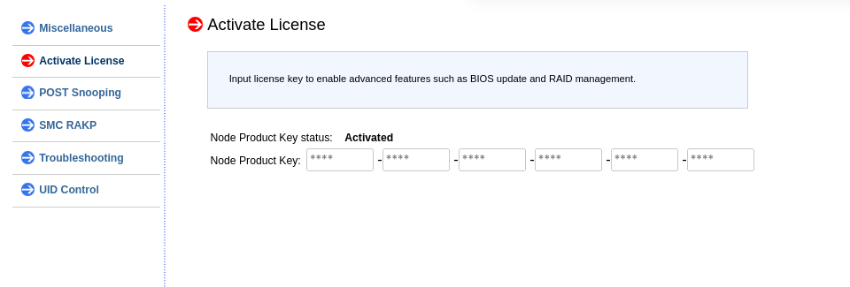

# CICD: O-DU FH 7.2 on Kubernetes

Status: In progress
Created time: June 20, 2025 11:58 AM
Tag: O2

***Table of Content***

<!-- vim-markdown-toc GFM -->

* [Introduction](#introduction)
    * [OAI](#oai)
    * [srsRAN](#srsran)
* [Progress](#progress)
    * [OS Setup](#os-setup)
        * [Resource Build](#resource-build)
        * [Cluster Config](#cluster-config)
        * [Special Manifests](#special-manifests)
* [Machine Details](#machine-details)
    * [Node 1: Joule](#node-1-joule)
    * [Node II: Newton](#node-ii-newton)
    * [Node III: Asus Server [Pending]](#node-iii-asus-server-pending)
* [Prerequisites](#prerequisites)
    * [Build gNB image](#build-gnb-image)
    * [OS Install](#os-install)
* [Cluster Setup](#cluster-setup)
    * [Master Node](#master-node)
    * [Worker Node](#worker-node)
        * [Join as Worker Node](#join-as-worker-node)
        * [BIOS: SRIOV Setup](#bios-sriov-setup)
        * [SRIOV Setup: Kubernetes Level](#sriov-setup-kubernetes-level)
    * [Cluster Service:](#cluster-service)
        * [Cluster Service: Ingress Router Kong](#cluster-service-ingress-router-kong)
        * [Cluster Service: Prometheus Metric Logging](#cluster-service-prometheus-metric-logging)
    * [- Credentials](#--credentials)
        * [Cluster Service: Cilium CNI (Container Network Interface)](#cluster-service-cilium-cni-container-network-interface)
        * [Cluster Service: Multus CNI  (Container Network Interface)](#cluster-service-multus-cni--container-network-interface)
        * [Cluster Service: SRIOV Network Operator](#cluster-service-sriov-network-operator)
    * [External Support](#external-support)
        * [HAProxy](#haproxy)
        * [ISO Host](#iso-host)
        * [GRUB Argument](#grub-argument)
* [O-RU Setup](#o-ru-setup)
* [OAI  GNB Setup](#oai--gnb-setup)
    * [Helm Chart: OAI 7.2 FH](#helm-chart-oai-72-fh)
    * [GNB Connection with O-RU](#gnb-connection-with-o-ru)
    * [GNB Connection with OAI CN](#gnb-connection-with-oai-cn)
    * [CN: Setup Open5GS](#cn-setup-open5gs)
    * [GNB: Connection to Open5GS](#gnb-connection-to-open5gs)
    * [GNB: Vanilla Kubernetes CPU manager policy=none](#gnb-vanilla-kubernetes-cpu-manager-policynone)
* [SRSRAN GNB](#srsran-gnb)
* [Validation and Testing](#validation-and-testing)
    * [Open5GS → GNB](#open5gs--gnb)
    * [GNB → O-RU](#gnb--o-ru)
    * [UE → 5G Network](#ue--5g-network)
* [Hard Lessons](#hard-lessons)
    * [Namespace Stuck on Terminating](#namespace-stuck-on-terminating)
        * [Node Taint Loop Due to SrIOV](#node-taint-loop-due-to-sriov)
        * [GNB:  Missing parameters on OAI configmap](#gnb--missing-parameters-on-oai-configmap)
        * [GNB: Failure to attach on VFIO Interface due to hugepages](#gnb-failure-to-attach-on-vfio-interface-due-to-hugepages)
    * [SRIOV: Boot Loop due to vfio-pci](#sriov-boot-loop-due-to-vfio-pci)
    * [GNB: SCTP Transmission Failure between PODs when using default CNI](#gnb-sctp-transmission-failure-between-pods-when-using-default-cni)
    * [GNB: MSG3 Scheduling Failure](#gnb-msg3-scheduling-failure)
    * [UE: Attach Failure](#ue-attach-failure)
    * [- Kubernetes allocate isolated CPUs for everyone, not only GNB](#--kubernetes-allocate-isolated-cpus-for-everyone-not-only-gnb)
    * [UE: OAI Core Network with LiteOn RU](#ue-oai-core-network-with-liteon-ru)
    * [Open5GS: Bitnami related images](#open5gs-bitnami-related-images)
    * [Kubelet: CPU MAnager Policy](#kubelet-cpu-manager-policy)
    * [GNB: Crash upon high load from UE on C3](#gnb-crash-upon-high-load-from-ue-on-c3)
        * [**Symptomps I**](#symptomps-i)
        * [**Symptoms II**](#symptoms-ii)
        * [Resolultion](#resolultion)
        * [GNB: After O-RU reboot num_bytes always wrong](#gnb-after-o-ru-reboot-num_bytes-always-wrong)
        * [O-RU LiteON: Center Frequency](#o-ru-liteon-center-frequency)
        * [K8S: topologyManagerPolicy](#k8s-topologymanagerpolicy)
    * [SRSRAN: PCI SRIOV](#srsran-pci-sriov)

<!-- vim-markdown-toc -->


# Introduction

<aside>
⚙

***Handover Note***
https://github.com/bmw-ece-ntust/nino-c-ran-installation

</aside>

## OAI

Recreate the O-DU 7.2 on kubernetes environment

- Original Documentation

    [](https://gitlab.eurecom.fr/oai/openairinterface5g/-/blob/develop/doc/ORAN_FHI7.2_Tutorial.md#common)

- Chart: Predefined

    [](https://gitlab.eurecom.fr/oai/orchestration/charts/-/tree/oai-gnb-fhi-72?ref_type=heads)

- Docker Compose: Predefined

    [](https://gitlab.eurecom.fr/oai/openairinterface5g/-/blob/develop/ci-scripts/yaml_files/sa_fhi_7.2_vvdn_gnb/docker-compose.yml?ref_type=heads)

- RedHat vDU Reference Spec

    [Chapter 3. Reference design specifications | Scalability and performance | OpenShift Container Platform | 4.14 | Red Hat Documentation](https://docs.redhat.com/en/documentation/openshift_container_platform/4.14/html/scalability_and_performance/reference-design-specifications)


## srsRAN

- srsRAN gNB Documentation

    [srsRAN gNB on Kubernetes — srsRAN Project  documentation](https://docs.srsran.com/projects/project/en/latest/tutorials/source/k8s/source/index.html)


**Special Treatments:**

1. OS: Numa Allocation

    **12vCPU Minimum Setup**

    > *Currently the default OAI 7.2 configuration file requires isolated **CPUs 0,2,4** for DPDK/libXRAN, **CPU 6** for `ru_thread`, **CPU 8** for `L1_rx_thread` and **CPU 10** for `L1_tx_thread`. It is preferrable to have all these threads on the same socket.*
    >

    | **Threads** | **Allocated CPUs** |
    | --- | --- |
    | DPDK | 0,2,4 |
    | OAI `ru_thread` | 6 |
    | OAI `L1_rx_thread` | 8 |
    | OAI `L1_tx_thread` | 10 |
    | OAI `nr-softmodem` | 1,3,5 |
    | Kernel | 7,9,11 |

    **32vCPU Setup**

    | **Threads** | **Allocated CPUs** |
    | --- | --- |
    | DPDK | 0,2,4 |
    | OAI `ru_thread` | 6 |
    | OAI `L1_rx_thread` | 8 |
    | OAI `L1_tx_thread` | 10 |
    | OAI `nr-softmodem` | 1,3,5,7,9,11,13,15 |
    | Kernel | 16-31 |
2. OS: Hugepages
    1. One NUMA Node

        ```bash
         default_hugepagesz=1GB hugepagesz=1G hugepages=20
        ```

    2. Two NUMA Node

        ```bash
        hugepagesz=1G hugepages=40 hugepagesz=2M hugepages=0
        ```

3. OS: DPDK or Kubernetes:DPDK
    - Setup on OS then utilize from Kubernetes
    - Setup on Kubernetes ?
4. OS:PTP or Kubernetes:PTP
    1. `/etc/ptp4l.conf`

        ```bash
        #/etc/ptp4l.conf
        [global]
        domainNumber            24
        slaveOnly               1
        time_stamping           hardware
        tx_timestamp_timeout    1
        logging_level           6
        summary_interval        0
        #priority1               127

        [your_PTP_ENABLED_NIC]
        network_transport       L2
        hybrid_e2e              0
        ```

    2. `/etc/sysconfig/pc2sys`

        ```bash
        OPTIONS="-a -r -r -n 24"
        ```

    3. Service → Could be handled by  kubernetes

        `/usr/lib/systemd/system/phc2sys.service`

        ```bash
        [Unit]
        Description=Precision Time Protocol (PTP) service
        After=network-online.target
        Wants=network-online.target

        [Service]
        Type=simple
        EnvironmentFile=-/etc/sysconfig/ptp4l
        ExecStart=/usr/sbin/ptp4l $OPTIONS

        [Install]
        WantedBy=multi-user.target

        ```

        `/usr/lib/systemd/system/phc2sys.service`

        ```bash
        [Unit]
        Description=Synchronize system clock or PTP hardware clock (PHC)
        After=ntpdate.service ptp4l.service

        [Service]
        Type=simple
        EnvironmentFile=-/etc/sysconfig/phc2sys
        ExecStart=/usr/sbin/phc2sys $OPTIONS

        [Install]
        WantedBy=multi-user.target
        ```

5. Kubernetes: CPU Allocation
    1. CPU Allocation and lock contention
    2. System Admin POD
6. Binary: OAI-FHI gNB branch `2025.w25`
    1. Prerequisites
        - DPDK binary
        - ORAN OSC FH Patch (Rel. E & F)
        - Build Directly using official Dockerfile

            [](https://gitlab.eurecom.fr/oai/openairinterface5g/-/blob/develop/docker/Dockerfile.gNB.fhi72.ubuntu22?ref_type=heads)

        - Pull official image

            ```bash
            docker pull oaisoftwarealliance/oai-gnb-fhi72:2025.w23
            ```

    2. Jenkins Setup

        <aside>
        💡

        Enable `codeready` subscription on jenkins node (RHEL 8.9)

        ```bash
        subscription-manager repos --enable codeready-builder-for-rhel-8-$(arch)-rpms
        sudo dnf install meson ninja-build
        sudo dnf group install "Development Tools"
        ```

        </aside>

    3. Build Steps: Freestyle Mode

        ```bash
        export REGISTRY=quay.bmw.lab
        export QUAY_USER=infidel
        export QUAY_REPO=$REGISTRY/$QUAY_USER

        export NAME_BASE=ran-base
        export NAME_BUILD=ran-build-fhi72
        export NAME_GNB=oai-gnb-fhi72
        export TAG=latest

        #NAME
        #export NAME=$NAME_BUILD
        # Login
        podman login --tls-verify=false -u="infidel+bmw_jenkins_00" -p="4W7AYC8O9NMIVZYRD4Y77986PANLRPQROPU4H8CHU1CIR3JABIP9NPX4OOM7GNF3" $REGISTRY
        # Build oai-base
        podman build -t $NAME_BASE -f docker/Dockerfile.base.ubuntu22 .

        # BUILD oai-build
        podman build -t $NAME_BUILD -f docker/Dockerfile.build.fhi72.ubuntu22  .
        podman tag $NAME_BUILD $QUAY_REPO/$NAME_BUILD:$TAG
        #podman push --tls-verify=false $QUAY_REPO/$NAME:$TAG

        #Build oai-gnb
        podman build -t $NAME_BUILD -f docker/Dockerfile.gNB.fhi72.ubuntu22 .
        podman tag $NAME_BUILD $QUAY_REPO/$NAME:$TAG
        podman push --tls-verify=false $QUAY_REPO/$NAME_GNB:$TAG
        podman system prune -f

        ```


# Progress

<aside>
⚠️ Define each steps carefully here.

</aside>

## OS Setup

[nginx-iso] | 2025/09/10 07:58:58 [emerg] 1#1: open() "/etc/nginx/conf.d/default.conf" failed (13: Permission denied) in /etc/nginx/nginx.conf:31
[nginx-iso] | nginx: [emerg] open() "/etc/nginx/conf.d/default.conf" failed (13: Permission denied) in /etc/nginx/nginx.conf:31

### Resource Build

1. Build the necessary binary using official dockerfile
    1. Branch: `2025.w25`
    2. Build:  `docker/Dockerfile.build.fhi72.ubuntu22`
    3. gNB: `docker/Dockerfile.gNB.fhi72.ubuntu22`
2.

### Cluster Config

### Special Manifests

# Machine Details

## Node 1: Joule

> Dell R750
>

|  | IP | Username | Password |
| --- | --- | --- | --- |
| BMC | 192.168.8.222 | root | ***** |
| OS | 192.168.8.74 | infidel | ****** |

## Node II: Newton

Supermicro 829-9

|  | IP | Username | Password |
| --- | --- | --- | --- |
| BMC | 192.168.10.88 | ADMIN | ADMIN |
| OS | 192.168.8.53 | infidel | ***** |


**Enable IPMI Features: Virtual Media, RAID, etc.**

You need to activate your supermicro server using your license token to use additional features such as VirtualMedia. If you dont have the license token, you can still derive the token based on the BMC mac address of your machine. Using the following  sofware: https://github.com/bwachter/supermicro-ipmi-key.

```bash
# Derive against your BMC Mac Address
./supermicro-ipmi-key AC:1F:6B:04:C0:63
00ce 8e4f f566 f576 3cb4 3e90
```



## Node III: Asus Server [Pending]

|  | IP | Username | Password |
| --- | --- | --- | --- |
| BMC | 192.168.10.94 | admin | admin |
| OS | N/A | N/A | N/A |

# Prerequisites

## Build gNB image

```yaml
git clone https://gitlab.eurecom.fr/oai/openairinterface5g.git
cd openairinterface5g
# default branch is develop, to change use git checkout <BRANCH>
docker build --target ran-base --tag ran-base:latest --file docker/Dockerfile.base.ubuntu .
# if you want use USRP, AW2S and RFSimulator radios
docker build --target ran-build --tag ran-build:latest --file docker/Dockerfile.build.ubuntu .
# if you want to use front-haul 7.2 and RFSimulator radios
docker build --tag ran-build-fhi72:latest --file docker/Dockerfile.build.fhi72.ubuntu .
```

```yaml
docker build --target oai-gnb-fhi72 --tag oai-gnb-fhi72:latest --file docker/Dockerfile.gNB.fhi72.ubuntu  .
```

## OS Install

- I assume the reader have knowledge to install RedHat OS on baremetal server or VMs.
- If you don’t, read this for manual installation

    [Chapter 4. Quick Installation Guide | Installation Guide | Red Hat Enterprise Linux | 7 | Red Hat Documentation](https://docs.redhat.com/en/documentation/red_hat_enterprise_linux/7/html/installation_guide/chap-simple-install)


# Cluster Setup

<aside>
⚠️

References

Chart → [https://gitlab.eurecom.fr/ymarselino/charts](https://gitlab.eurecom.fr/ymarselino/charts)

</aside>

## Master Node

```yaml
sudo kubeadm init  --apiserver-advertise-address=192.168.8.114   --pod-network-cidr=10.244.0.0/16   --service-cidr=10.96.0.0/12
```

**Install CNI: Cilium**

```yaml
# Add Cilium repo
helm repo add cilium https://helm.cilium.io/
helm repo update

# Install Cilium as primary CNI
helm install cilium cilium/cilium --version 1.14.0 \
    --namespace kube-system \
    --set cni.exclusive=false \
    --set hubble.relay.enabled=true \
    --set hubble.ui.enabled=true
```

**Install CNI: Multus**

```yaml
kubectl apply -f https://raw.githubusercontent.com/k8snetworkplumbingwg/multus-cni/master/deployments/multus-daemonset.yml
```

```yaml
sudo swapoff -a
sudo sed -i '/ swap / s/^\(.*\)$/#\1/g' /etc/fstab
```

**Firewall**

```yaml
sudo firewall-cmd --permanent --add-port={6443,2379,2380,10250,10251,10252,10257,10259,179}/tcp
sudo firewall-cmd --permanent --add-port=4789/udp
sudo firewall-cmd --reload
```

**Kernel Module**

```yaml
sudo echo -e "overlay\nbr_netfilter" | sudo tee /etc/modules-load.d/crio.conf && sudo modprobe overlay && sudo modprobe br_netfilter
```

**IP Forward**

```yaml
sudo echo -e "net.bridge.bridge-nf-call-iptables = 1\nnet.ipv4.ip_forward = 1\nnet.bridge.bridge-nf-call-ip6tables = 1" | sudo tee -a /etc/sysctl.d/k8s.conf
```

## Worker Node

### Join as Worker Node

```yaml

kubeadm join 192.168.8.114:6443 --token 78ipje.lld4qsmn2ug1tqlz \
	--discovery-token-ca-cert-hash sha256:754e8c8c8dad70dcc24cc06642003f57f9e804714eeb1cdd5f7081a8b2c265d0
```

### BIOS: SRIOV Setup

**Bug:** Cannot Allocate memory

```bash
$ sudo sh -c 'echo 2 > /sys/class/net/ens7f0/device/sriov_numvfs'
sh: line 1: echo: write error: Cannot allocate memory
```

**Resolution:**

Enable SRIOV from integrated BIOS setting in iDRAC
`iDRAC -> Configuration -> BIOS Settings -> Integrated Devices -> SR-IOV Global Enable = ENABLED`


### SRIOV Setup: Kubernetes Level

1. Install sriov-network-operator
    1. Install sriov-network-operator, i.e. using helm chart

        ```bash
        helm install -n sriov-network-operator --create-namespace --version 1.5.0 --set sriovOperatorConfig.deploy=true sriov-network-operator oci://ghcr.io/k8snetworkplumbingwg/sriov-network-operator-chart
        ```

    2. Update your sriovoperatorconfig to allow daemon and device-plugin as the following.

        ```bash
        apiVersion: sriovnetwork.openshift.io/v1
        kind: SriovOperatorConfig
        metadata:
          annotations:
            meta.helm.sh/release-name: sriov-network-operator
            meta.helm.sh/release-namespace: sriov-network-operator
          creationTimestamp: "2025-09-04T15:37:15Z"
          finalizers:
          - operatorconfig.finalizers.sriovnetwork.openshift.iohttps://www.ibm.com/docs/en/cloud-private/3.2.0?topic=console-namespace-is-stuck-in-terminating-state
          generation: 3
          labels:
            app.kubernetes.io/managed-by: Helm
          name: default
          namespace: sriov-network-operator
          resourceVersion: "847616"
          uid: de142eb5-f1b9-4787-9b20-868c7ff88674
        spec:
          configDaemonNodeSelector:
            feature.node.kubernetes.io/network-sriov.capable: "true"
          configurationMode: daemon
          enableInjector: false
          enableOperatorWebhook: false
          logLevel: 2
        ```

        <aside>
        ⚠️

        Always make sure you install sriov network operator with config-daemon and device-plugin. Otherwise you can not interact with your NIC.

        </aside>

    3. Make sure you have the necessary pods

        ```bash
        $ kubectl get pods -n sriov-network-operator
        NAME                                      READY   STATUS    RESTARTS   AGE
        sriov-device-plugin-ptbgj                 1/1     Running   0          5m56s
        sriov-network-config-daemon-2tgdc         1/1     Running   0          6m42s
        sriov-network-operator-6cd7fff6fc-flzgp   1/1     Running   0          7m57s
        ```

2. Tag the target node with sriov.capable label

    ```bash
    kubectl label node <node-name> feature.node.kubernetes.io/network-sriov.capable=true
    kubectl label node <node-name> node-role.kubernetes.io/worker=worker
    ```

3. Create `SriovNetworkNodePolicy` and define your need there
    1. Generic Purpose Example

        ```bash
        apiVersion: sriovnetwork.openshift.io/v1
        kind: SriovNetworkNodePolicy
        metadata:
          name: policy-1
          namespace: sriov-network-operator
        spec:
          deviceType: vfio-pci
          mtu: 9216
          isRdma: false
          linkType: 'eth'
          deviceType: 'netdevice'
          nicSelector:
            vendor: '8086'
            deviceID: '159b'
            rootDevices:
            - '0000:ca:00.0'
          nodeSelector:
            feature.node.kubernetes.io/network-sriov.capable: "true"
          numVfs: 4
          priority: 11
          resourceName: REOURCE_NAME_U_PLANE

        ```

    2. OAI 72

        ```bash
        apiVersion: sriovnetwork.openshift.io/v1
        kind: SriovNetworkNodePolicy
        metadata:
          name: RESOURCE_NAME_U_PLANE
          namespace: sriov-network-operator
        spec:
          resourceName: RESOURCE_NAME_U_PLANE
          nodeSelector:
            feature.node.kubernetes.io/network-sriov.capable: "true"
          priority: 11
          mtu: 9216
          deviceType: vfio-pci
          isRdma: false
          numVfs: 4
          linkType: eth
          nicSelector:
            pfNames:
              - 'ens7f0#0-1'
            rootDevices:
              - '0000:ca:00.0'
        ---
        apiVersion: sriovnetwork.openshift.io/v1
        kind: SriovNetworkNodePolicy
        metadata:
          name: RESOURCE_NAME_C_PLANE
          namespace: sriov-network-operator
        spec:
          resourceName: RESOURCE_NAME_C_PLANE
          nodeSelector:
            feature.node.kubernetes.io/network-sriov.capable: "true"
          priority: 12
          mtu: 9216
          deviceType: vfio-pci
          isRdma: false
          numVfs: 4
          linkType: eth
          nicSelector:
            pfNames:
              - 'ens7f0#2-3'
            rootDevices:
              - '0000:ca:00.0'
        ```

    3. …

## Cluster Service:

### Cluster Service: Ingress Router Kong

1. Upload TLS certificate
2.

### Cluster Service: Prometheus Metric Logging

<aside>
⚠️

External Links:

[Grafana](https://ocloud-bmwlab.duckdns.org/grafana/public-dashboards/b8142df0165147aca42951f763561d49)

</aside>

Prometheus

- Access
    -
- Credentials
-

### Cluster Service: Cilium CNI (Container Network Interface)

### Cluster Service: Multus CNI  (Container Network Interface)

### Cluster Service: SRIOV Network Operator

## External Support

### HAProxy

```yaml

```

### ISO Host

Setup simple `nginx` server to store our installation ISO for remote installation via IPMI

1. Create docker-compose.yaml

    ```yaml
    version: '3'

    services:
      nginx-iso:
        image: docker.io/nginx:alpine
        ports:
          - "3001:80"
        volumes:
          - ./nginx.conf:/etc/nginx/conf.d/default.conf:Z
          - ./nginx-iso/isos:/usr/share/nginx/html/isos:Z
        restart: unless-stopped
    ```

2. Put the iso files under `nginx-iso/isos/`
3. CoreOS Related
    1. Create user level `systemd` service for it

        ```bash
        #  ~/.config/systemd/user/iso-hosts.service
        [Unit]
        Description=Nginx Iso Host
        Wants=network-online.target
        After=network-online.target

        [Service]
        Type=exec
        Restart=always
        RemainAfterExit=true
        TimeoutStopSec=120
        #User=core
        #Group=core
        ExecStart=podman-compose -f /var/home/core/iso-hosts/docker-compose.yaml up -d --force-recreate
        ExecStop=podman-compose -f /var/home/core/iso-hosts/docker-compose.yaml down
        KillMode=process

        #/var/home/core/gitea
        #/usr/bin/podman-compose

        [Install]
        WantedBy=multi-user.target
        ```

    2. Enable on start-up

        ```bash
        systemctl --user enable iso-hosts
        systemctl --user start iso-hosts
        ```

    3. …
4. Verify your iso hostts

    ```yaml
     curl http://192.168.8.75:3001/isos/
    ```


### GRUB Argument

**Single Numa Node**

```yaml
GRUB_TIMEOUT=5
GRUB_DISTRIBUTOR="$(sed 's, release .*$,,g' /etc/system-release)"
GRUB_DEFAULT=saved
GRUB_DISABLE_SUBMENU=true
GRUB_TERMINAL_OUTPUT="console"
GRUB_CMDLINE_LINUX="mitigations=off usbcore.autosuspend=-1 selinux=0 enforcing=0 nmi_watchdog=0 softlockup_panic=0 audit=0 nohz_full=0-15 rcu_nocbs=0-15 rcu_nocb_poll mce=off hugepagesz=1G hugepages=40 hugepagesz=2M hugepages=0 default_hugepagesz=1G kthread_cpus=16-31 vfio_pci.enable_sriov=1 intel_iommu=on iommu=pt vfio-pci.enable_sriov=1"
GRUB_DISABLE_RECOVERY="true"
GRUB_ENABLE_BLSCFG=true
```

**From Slack**

```bash
BOOT_IMAGE=/vmlinuz-5.15.0-1073-realtime root=/dev/mapper/ubuntu--vg-lv--0 ro isolcpus=managed_irq,6-35 nohz_full=6-35 nohz=on rcu_nocbs=6-35 kthread_cpus=0-5 irqaffinity=0-5 rcu_nocb_poll selinux=0 enforcing=0 crashkernel=auto intel_pstate=disable nosoftlockup hugepagesz=1G hugepages=40 hugepagesz=2M hugepages=0 default_hugepagesz=1G mitigations=off intel_iommu=on processor.max_cstate=1 idle=poll intel_idle.max_cstate=0 iommu=pt skew_tick=1 tsc=nowatchdog nmi_watchdog=0 softlockup_panic=0 audit=0 mce=off
```

**On System**

```bash
BOOT_IMAGE=(hd0,msdos1)/vmlinuz-5.14.0-70.13.1.rt21.83.el9_0.x86_64 root=/dev/mapper/rhel-root ro crashkernel=1G-4G:192M,4G-64G:256M,64G-:512M resume=/dev/mapper/rhel-swap rd.lvm.lv=rhel/root rd.lvm.lv=rhel/swap skew_tick=1 tsc=reliable rcupdate.rcu_normal_after_boot=1 isolcpus=managed_irq,domain,0-15 intel_pstate=disable nosoftlockup tsc=reliable mitigations=off usbcore.autosuspend=-1 intel_iommu=on intel_iommu=pt selinux=0 enforcing=0 nmi_watchdog=0 softlockup_panic=0 audit=0 nohz_full=0-15 rcu_nocbs=0-15 rcu_nocb_poll mce=off hugepagesz=1G hugepages=40 hugepagesz=2M hugepages=0 default_hugepagesz=1G kthread_cpus=16-31
```

```bash
  kernelArguments:
    - no_timer_check  # 禁止运行内核中时钟IRQ源缺陷检测代码。主要用于解决某些AMD平台的CPU占用过高以及时钟过快的故障。
    - clocksource=tsc # clocksource={jiffies|acpi_pm|hpet|tsc} tsc TSC(Time Stamp Counter)的主体是位于CPU里面的一个64位TSC寄存器，与传统的以中断形式存在的周期性时钟不同，TSC是以计数器形式存在的单步递增性时钟，两者的区别在于，周期性时钟是通过周期性触发中断达到计时目的，如心跳一般。而单步递增时钟则不发送中断，取而代之的是由软件自己在需要的时候去主动读取TSC寄存器的值来获得时间。TSC的精度更高并且速度更快，但仅能在较新的CPU(Sandy Bridge之后)上使用。
    - tsc=perfect
    - intel_pstate=disable  # intel_pstate驱动支持现代Intel处理器的温控。 intel_pstate=disable选项可以强制使用传统遗留的CPU驱动acpi_cpufreq
    - selinux=0
    - enforcing=0
    - nmi_watchdog=0  # 配置nmi_watchdog(不可屏蔽中断看门狗) 0 表示关闭看门狗；
    - softlockup_panic=0  # 是否在检测到软死锁(soft-lockup)的时候让内核panic
    - isolcpus=2-19 # 将列表中的CPU从内核SMP平衡和调度算法中剔除。 提出后并不是绝对不能再使用该CPU的，操作系统仍然可以强制指定特定的进程使用哪个CPU(可以通过taskset来做到)。该参数的目的主要是用于实现特定cpu只运行特定进程的目的。
    - nohz_full=2-19  #在 16 核的系统中，设定 nohz_full=1-15 可以在 1 到 15 内核中启用动态无时钟内核性能，并将所有的计时移动至唯一未设定的内核中（0 内核）, [注意](1)"boot CPU"(通常都是"0"号CPU)会无条件的从列表中剔除。(2)这里列出的CPU编号必须也要同时列进"rcu_nocbs=..."参数中。
    - idle=poll # 对CPU进入休眠状态的额外设置。poll 从根本上禁用休眠功能(也就是禁止进入C-states状态)，可以略微提升一些CPU性能，但是却需要多消耗许多电力，得不偿失。不推荐使用。
    - default_hugepagesz=1G
    - hugepagesz=1G
    - hugepages=32
    - skew_tick=1 # Offset the periodic timer tick per cpu to mitigate xtime_lock contention on larger systems, and/or RCU lock contention on all systems with CONFIG_MAXSMP set. Note: increases power consumption, thus should only be enabled if running jitter sensitive (HPC/RT) workloads.
    - rcu_nocbs=2-19  # 指定哪些CPU是No-CB CPU
    - kthread_cpus=0-1
    - irqaffinity=0-1 # 通过内核参数irqaffinity==[cpu列表],设置linux中断的亲和性，设置后，默认由这些cpu核来处理非CPU绑定中断。避免linux中断影响cpu2、cpu3上的实时应用，将linux中断指定到cpu0、cpu1处理。
    - rcu_nocb_poll # 减少了需要从卸载cpu执行唤醒操作。避免了rcuo kthreads线程显式的唤醒。另一方面这会增加耗电量
    - iommu=pt
    - intel_iommu=on
```

# O-RU Setup

```yaml
Band Width = 100000000
Center Frequency = 3450720000
Compression Bit = 9
Control and User Plane vlan = 4
M Plane vlan = 0
default gateway = 10.101.131.254
dpd mode : Enable
DU MAC Address = 001122334466
phase compensation mode : Enable
RX attenuation = 14
TX attenuation = 15
subcarrier spacing = 1
rj45_vlan_ip = 10.101.131.61
SFP_vlan_ip = 10.101.131.62
SFP_non_vlan_static_ip = 192.168.1.100
prach eAxC-id port 0, 1, 2, 3 = 0x0004, 0x0005, 0x0006, 0x0007
slotid = 0x00000001
jumboframe = 0x00000001
sync source : PTP
```

```yaml
Band Width = 100000000
Center Frequency = 3450720000
Compression Bit = 9
Control and User Plane vlan = 4
M Plane vlan = 0
default gateway = 10.101.131.254
dpd mode : Enable
DU MAC Address = 001122334466
phase compensation mode : Enable
RX attenuation = 14
TX attenuation = 15
subcarrier spacing = 1
rj45_vlan_ip = 10.101.131.61
SFP_vlan_ip = 10.101.131.62
SFP_non_vlan_static_ip = 192.168.1.100
prach eAxC-id port 0, 1, 2, 3 = 0x0004, 0x0005, 0x0006, 0x0007
slotid = 0x00000001
jumboframe = 0x00000001
sync source : PTP
#
```

# OAI  GNB Setup

## Helm Chart: OAI 7.2 FH

|  |  |
| --- | --- |
| LiteON FH | `00:aa:ff:bb:ff:cc` |
|  |  |

**Missing Config Param**

- Param Sequence
    - [env Vars] → [ configMap ] → [du.conf]

| ConfigMap | envVars | du.conf |
| --- | --- | --- |
| @AMF_IP_ADDRESS@ | ✅ | ✅ |
| @N2_IP_ADDRESS@ | ✅ | ✅ |
| @N3_IP_ADDRESS@ | ✅ | ✅ |
| @L1_RX_CORE@ | N/A | Allocate By System |
| @L1_TX_CORE@ |  | Allocate By System |
| @RU_CORE@ |  | Allocate By System |
| @C_PLANE_PCI_ADD@ | ⚠️ | Allocate By System |
| @U_PLANE_PCI_ADD@ | ⚠️ | Allocate By System |
| @SYSTEM_CORE@ | 🚫 | Allocate By System |
| @IO_CORE@ | 🚫 | Allocate By System |
| @WORKER_CORE_LIST@ | 🚫 | Allocate By System |
- Entry Point Args

    ```toml
     args:
     -  CONF='/opt/oai-gnb/etc/gnb.conf';
        AMF_IP_ADDRESS=$(getent hosts $AMF_HOST | awk '{print $1}');
        AMF_IP_ADDRESS=$(if [[ $AMF_IP_ADDRESS ]]; then echo $AMF_IP_ADDRESS; else echo $AMF_HOST;fi);
        N2_IP_ADDRESS=$(ip -f inet addr show $N2_IF_NAME | grep -o "inet [0-9]*\.[0-9]*\.[0-9]*\.[0-9]*" | grep -o "[0-9]*\.[0-9]*\.[0-9]*\.[0-9]*");
        N3_IP_ADDRESS=$(ip -f inet addr show $N3_IF_NAME | grep -o "inet [0-9]*\.[0-9]*\.[0-9]*\.[0-9]*" | grep -o "[0-9]*\.[0-9]*\.[0-9]*\.[0-9]*");
        PCI_ADD_U=PCIDEVICE_OPENSHIFT_IO_${SRIOV_RESOURCE_NAME_UPLANE^^};
        PCI_ADD_C=PCIDEVICE_OPENSHIFT_IO_${SRIOV_RESOURCE_NAME_CPLANE^^};
        U_PLANE_PCI_ADD=$(echo ${!PCI_ADD_U});
        C_PLANE_PCI_ADD=$(echo ${!PCI_ADD_C});
        LIST=($(grep -oP '@[a-zA-Z0-9_]+@' $CONF | grep CORE | sed -e "s#@##g" ));
        CPUS=($(cat /sys/fs/cgroup/cpuset/cpuset.cpus | awk '/-/{for (i=$1; i<=$2; i++)printf "%s%s",i,ORS;next} 1' ORS=' ' RS=, FS=-));
        for i in ${!LIST[*]}; do eval "${LIST[$i]}=${CPUS[$i]}";done;
        VARS=$(grep -oP '@[a-zA-Z0-9_]+@' $CONF);
        for v in ${VARS};do N=`echo $v | sed -e "s#@##g"`; E="${E} -e s/${v}/${!N}/g";E="${E#' -e '}";done;
        sed -e ${E} $CONF | tee /tmp/du.conf;
        /bin/sleep infinity;
        #exec /opt/oai-gnb/bin/nr-softmodem -O /tmp/du.conf $USE_ADDITIONAL_OPTIONS;
    {{- else}}
    command:
      - /bin/sleep
      - infinity
    {{- end}}
    ```

- ConfigMap Template
    - Inconsistent value reference
    - *Dump*

        ```toml
        ---
        #https://gitlab.eurecom.fr/oai/openairinterface5g/-/blob/develop/targets/PROJECTS/GENERIC-NR-5GC/CONF/gnb.sa.band78.273prb.fhi72.4x4-benetel650.conf?ref_type=heads
        apiVersion: v1
        kind: ConfigMap
        metadata:
          name: {{ .Chart.Name }}-configmap
        data:
          gnb.conf: |
            Active_gNBs = ( "{{ .Values.config.gnbName }}");
            # Asn1_verbosity, choice in: none, info, annoying
            Asn1_verbosity = "none";
            gNBs =
            (
             {
                ////////// Identification parameters:
                gNB_ID    =  0xe12;
                gNB_name  =  "{{ .Values.config.gnbName }}";

                // Tracking area code, 0x0000 and 0xfffe are reserved values
                tracking_area_code  = {{ .Values.config.tac}} ;
                plmn_list = ({ mcc = {{ .Values.config.mcc}}; mnc = {{ .Values.config.mnc}}; mnc_length = 2; snssaiList = ({ sst = {{ .Values.config.sst}} }) });

                nr_cellid = 1;

                ////////// Physical parameters:

                pdsch_AntennaPorts_XP = 2;
                pdsch_AntennaPorts_N1 = 2;
                maxMIMO_layers        = 2;
                pusch_AntennaPorts    = 4;
                do_CSIRS              = 1;
                do_SRS                = 0 ;
                sib1_tda        = 15;
                #force_UL256qam_off    = 1;

                pdcch_ConfigSIB1 = (
                  {
                    controlResourceSetZero = 11;
                    searchSpaceZero = 0;
                  }
                );

                servingCellConfigCommon = (
                {
             #spCellConfigCommon

                  physCellId                                                    = 0;
                 # n_TimingAdvanceOffset                                         = 0;
            #  downlinkConfigCommon
                #frequencyInfoDL
                  # this is 3450.72 MHz (center frequency)
                  absoluteFrequencySSB                                          = 623328;
                  dl_frequencyBand                                              = 78;
                  # this is 3401.58 MHz
                  dl_absoluteFrequencyPointA                                    = 620052;
                  #scs-SpecificCarrierList
                    dl_offstToCarrier                                           = 0;
            # subcarrierSpacing
            # 0=kHz15, 1=kHz30, 2=kHz60, 3=kHz120
                    dl_subcarrierSpacing                                        = 1;
                    dl_carrierBandwidth                                         = 273;
                 #initialDownlinkBWP
                  #genericParameters
                   initialDLBWPlocationAndBandwidth                             = 1099; #38.101-1 Table 5.3.2-1
                   #
            # subcarrierSpacing
            # 0=kHz15, 1=kHz30, 2=kHz60, 3=kHz120
                    initialDLBWPsubcarrierSpacing                               = 1;
                  #pdcch-ConfigCommon
                    initialDLBWPcontrolResourceSetZero                          = 11;
                    initialDLBWPsearchSpaceZero                                 = 0;

              #uplinkConfigCommon
                 #frequencyInfoUL
                  ul_frequencyBand                                              = 78;
                  #scs-SpecificCarrierList
                  ul_offstToCarrier                                             = 0;
            # subcarrierSpacing
            # 0=kHz15, 1=kHz30, 2=kHz60, 3=kHz120
                  ul_subcarrierSpacing                                          = 1;
                  ul_carrierBandwidth                                           = 273;
                  pMax                                                          = 23;
                 #initialUplinkBWP
                  #genericParameters
                    initialULBWPlocationAndBandwidth                            = 1099;
            # subcarrierSpacing
            # 0=kHz15, 1=kHz30, 2=kHz60, 3=kHz120
                    initialULBWPsubcarrierSpacing                               = 1;
                  #rach-ConfigCommon
                    #rach-ConfigGeneric
                      prach_ConfigurationIndex                                  = 151;
            #prach_msg1_FDM
            #0 = one, 1=two, 2=four, 3=eight
                      prach_msg1_FDM                                            = 0;
                      prach_msg1_FrequencyStart                                 = 0;
                      zeroCorrelationZoneConfig                                 = 0;
                      preambleReceivedTargetPower                               = -100;
            #preamblTransMax (0...10) = (3,4,5,6,7,8,10,20,50,100,200)
                      preambleTransMax                                          = 8;
            #powerRampingStep
            # 0=dB0,1=dB2,2=dB4,3=dB6
                    powerRampingStep                                            = 3;
            #ra_ReponseWindow
            #1,2,4,8,10,20,40,80
                    ra_ResponseWindow                                           = 5;
            #ssb_perRACH_OccasionAndCB_PreamblesPerSSB_PR
            #1=oneeighth,2=onefourth,3=half,4=one,5=two,6=four,7=eight,8=sixteen
                    ssb_perRACH_OccasionAndCB_PreamblesPerSSB_PR                = 3;
            #oneHalf (0..15) 4,8,12,16,...60,64
                    ssb_perRACH_OccasionAndCB_PreamblesPerSSB                   = 15;
            #ra_ContentionResolutionTimer
            #(0..7) 8,16,24,32,40,48,56,64
                    ra_ContentionResolutionTimer                                = 7;
                    rsrp_ThresholdSSB                                           = 19;
            #prach-RootSequenceIndex_PR
            #1 = 839, 2 = 139
                    prach_RootSequenceIndex_PR                                  = 2;
                    prach_RootSequenceIndex                                     = 1;
                    # SCS for msg1, can only be 15 for 30 kHz < 6 GHz, takes precendence over the one derived from prach-ConfigIndex
                    #
                    msg1_SubcarrierSpacing                                      = 1,
            # restrictedSetConfig
            # 0=unrestricted, 1=restricted type A, 2=restricted type B
                    restrictedSetConfig                                         = 0,

            # this is the offset between the last PRACH preamble power and the Msg3 PUSCH, 2 times the field value in dB
                    msg3_DeltaPreamble                                          = 2;
                    p0_NominalWithGrant                                         = -96;

            # pucch-ConfigCommon setup :
            # pucchGroupHopping
            # 0 = neither, 1= group hopping, 2=sequence hopping
                    pucchGroupHopping                                           = 0;
                    hoppingId                                                   = 0;
                    p0_nominal                                                  = -96;
            # ssb_PositionsInBurs_BitmapPR
            # 1=short, 2=medium, 3=long
                  ssb_PositionsInBurst_PR                                       = 2;
                  ssb_PositionsInBurst_Bitmap                                   = 0x1;

            # ssb_periodicityServingCell
            # 0 = ms5, 1=ms10, 2=ms20, 3=ms40, 4=ms80, 5=ms160, 6=spare2, 7=spare1
                  ssb_periodicityServingCell                                    = 2;

            # dmrs_TypeA_position
            # 0 = pos2, 1 = pos3
                  dmrs_TypeA_Position                                           = 0;

            # subcarrierSpacing
            # 0=kHz15, 1=kHz30, 2=kHz60, 3=kHz120
                  subcarrierSpacing                                             = 1;

              #tdd-UL-DL-ConfigurationCommon
            # subcarrierSpacing
            # 0=kHz15, 1=kHz30, 2=kHz60, 3=kHz120
                  referenceSubcarrierSpacing                                    = 1;
                  # pattern1
                  # dl_UL_TransmissionPeriodicity
                  # 0=ms0p5, 1=ms0p625, 2=ms1, 3=ms1p25, 4=ms2, 5=ms2p5, 6=ms5, 7=ms10
                  dl_UL_TransmissionPeriodicity                                 = 6;
                  nrofDownlinkSlots                                             = 7;
                  nrofDownlinkSymbols                                           = 6;
                  nrofUplinkSlots                                               = 2;
                  nrofUplinkSymbols                                             = 4;

              ssPBCH_BlockPower                                                 = 10;
              }

              );

                # ------- SCTP definitions
                SCTP :
                {
                    # Number of streams to use in input/output
                    SCTP_INSTREAMS  = 2;
                    SCTP_OUTSTREAMS = 2;
                };

                ////////// AMF parameters:
                amf_ip_address = ({ ipv4 = "@AMF_IP_ADDRESS@"; });

                NETWORK_INTERFACES :
                {
                    GNB_IPV4_ADDRESS_FOR_NG_AMF              = "@N2_IP_ADDRESS@";
                    GNB_IPV4_ADDRESS_FOR_NGU                 = "@N3_IP_ADDRESS@";
                    GNB_PORT_FOR_S1U                         = 2152; # Spec 2152
                };
              }
            );

            MACRLCs = (
            {
              num_cc                      = 1;
              tr_s_preference             = "local_L1";
              tr_n_preference             = "local_RRC";
              pusch_TargetSNRx10          = 230;
              pucch_TargetSNRx10          = 230;
              dl_bler_target_upper=.35;
              dl_bler_target_lower=.15;
              ul_bler_target_upper=.35;
              ul_bler_target_lower=.15;
              pusch_FailureThres          = 100;
            }
            );

            L1s = (
            {
              num_cc = 1;
              tr_n_preference = "local_mac";
              prach_dtx_threshold = 100;
              pucch0_dtx_threshold = 80;
              pusch_dtx_threshold = 10;
              max_ldpc_iterations = 10;
              tx_amp_backoff_dB = 12; # needs to match O-RU configuration
              L1_rx_thread_core = @L1_RX_CORE@;
              L1_tx_thread_core = @L1_TX_CORE@; # relevant after merge of l1_tx_thread
              phase_compensation = 0; # needs to match O-RU configuration
            }
            );

            RUs = (
            {
              local_rf       = "no";
              nb_tx          = 4;
              nb_rx          = 4;
              att_tx         = 0
              att_rx         = 0;
              bands          = [78];
              max_pdschReferenceSignalPower = -27;
              max_rxgain                    = 75;
              sf_extension                  = 0;
              eNB_instances  = [0];
              ru_thread_core = @RU_CORE@;
              sl_ahead       = 10;
              ##beamforming 1x2 matrix: 1 layer x 2 antennas
              bf_weights = [0x00007fff, 0x0000,0x00007fff, 0x0000];
              tr_preference  = "raw_if4p5"; # important: activate FHI7.2
              do_precoding = 0; # needs to match O-RU configuration
            }
            );

            security = {
              # preferred ciphering algorithms
              # the first one of the list that an UE supports in chosen
              # valid values: nea0, nea1, nea2, nea3
              ciphering_algorithms = ( "nea0" );

              # preferred integrity algorithms
              # the first one of the list that an UE supports in chosen
              # valid values: nia0, nia1, nia2, nia3
              integrity_algorithms = ( "nia2", "nia0" );

              # setting 'drb_ciphering' to "no" disables ciphering for DRBs, no matter
              # what 'ciphering_algorithms' configures; same thing for 'drb_integrity'
              drb_ciphering = "yes";
              drb_integrity = "no";
            };

            log_config :
            {
              global_log_level                      ="info";
              hw_log_level                          ="info";
              phy_log_level                         ="info";
              mac_log_level                         ="info";
              rlc_log_level                         ="info";
              pdcp_log_level                        ="info";
              rrc_log_level                         ="info";
              ngap_log_level                        ="info";
              f1ap_log_level                        ="info";
            };

            fhi_72 = {
              dpdk_devices = ("@C_PLANE_PCI_ADD@", "@U_PLANE_PCI_ADD@");
              system_core = @SYSTEM_CORE@;
              io_core = @IO_CORE@;
              worker_cores = (@WORKER_CORE_LIST@);
              du_addr = ("{{ .Values.multus.ruInterface.cPlaneMacAdd }}", "{{ .Values.multus.ruInterface.uPlaneMacAdd }}");
              ru_addr = ("{{ .Values.config.ruCPlaneMacAdd }}", "{{ .Values.config.ruUPlaneMacAdd }}");
              mtu = {{ .Values.multus.ruInterface.mtu }};
              file_prefix = "fhi_72";
              fh_config = ({
                Tadv_cp_dl = 125;
                T2a_cp_dl = (259, 500);
                T2a_cp_ul = (25, 500);
                T2a_up = (134, 375);
                Ta3 = (152, 160);
                T1a_cp_dl = (419, 470);
                T1a_cp_ul = (285, 336);
                T1a_up = (294, 345);
                Ta4 = (0, 200);
                ru_config = {
                  iq_width = 9;
                  iq_width_prach = 9;
                  fft_size = 12;
                };
                prach_config = {
                  eAxC_offset = 4;
                };
              });
            };

        ```


## GNB Connection with O-RU


## GNB Connection with OAI CN


## CN: Setup Open5GS

1. Clone repository from gradiant
2. Go to `charts/open5gs` move values-5g.yaml to values.yaml
3. Perform `helm dependency build` to enable changes and install dependencies
4. Install Open5GS chart

    ```yaml
    helm upgrade --instal open5gs -n 5gs-cn .
    ```

5. Wait until all of the important pods are running properly

    

6. Expose webui via kube-proxy from your workstation with GUI, then access the proxy address.
    1. If you are using k9s, just press ctrl+f at open5gs-webui container.
    2. If you are using kubectl run the following command

        ```yaml
        kubectl port-forward open5gs-webui-xxxx -n 5gs-cn 9999:9999
        ```

    3. Open your browser with address `http://localhost:9999`
        1. Username: `admin` ; Password: `1423`

## GNB: Connection to Open5GS

1. Update amf-host at values.yaml into proper FQDN of the open5gs amf
    1. i.e. `amf_host: open5gs.5gs-cn`
2. Update

## GNB: Vanilla Kubernetes CPU manager policy=none

1. By default the cpu manager policy of kubernetes is none this way we can’t allocate individual threads that we already isolated from grub towards container.
2. Apply CPU manager policy

    ```yaml
    #/var/lib/kubelet/config.yaml
    ...
    cpuManagerPolicy: static
    systemReserved:
      cpu: 4000m
    kubeReserved:
      cpu: 2000m
    ```

3. Validate binding works from container
    1. Check allowed effective CPUs on container `cat /sys/fs/cgroup/cpuset.cpus.effective`
        1. If it shows the whole CPU of your machine i.e. 0-31, that means the setting is not properly configured yet

# SRSRAN GNB

<aside>
💡

Ref:

[](https://github.com/bmw-ece-ntust/johnson_note/blob/master/Integration/_Integrate%20srsRAN%20and%20Foxconn%20RPQN%20O-RU.md)

</aside>

1. Helm repo add SRSRAN
2. Clone srsran project

    ```jsx
        git clone --depth 1 --no-checkout <repository_URL> <local_directory_name>
    ```


**Chart Enhancment**

1. Multus: No control over VF, cant set MAC and VLAN

    I add the multus definition under template

    ```toml
    apiVersion: sriovnetwork.openshift.io/v1
    kind: SriovNetwork
    metadata:
      name: {{ .Chart.Name }}-{{ .Values.multus.ofh.ruName }}
      namespace:  {{ .Values.multus.ofh.sriovNetworkNamespace }}
    spec:
      networkNamespace: {{ .Release.Namespace }}
      resourceName:  {{ .Values.multus.ofh.sriovResourceName }}
      vlan: {{ .Values.multus.ofh.vlan }}
      spoofChk: "off"
      trust: "on"
      capabilities: '{ "mac": true }'

    ```

    Update the values.yaml to accomodate the multus related paramaters

    ```toml
    multus:
      ofh:
        enabled: true
        ruName: liteon
        sriovNetworkNamespace: sriov-network-operator
        sriovResourceName: sriov_srsran
        vlan: 6
        infterface_name: net_ofh
        du_mac: 00:11:22:33:44:66
    ```

2. Inject multus template from OAI

    Pod Annotations

    ```toml
    {
        "name": "gnb-fh72-liteon/oai-gnb-liteon--uplane",z
        "interface": "net1",
        "mac": "00:11:22:33:44:66",
        "mtu": 9216,
        "dns": {},
        "device-info": {
            "type": "pci",
            "version": "1.1.0",
            "pci": {
                "pci-address": "0000:ca:01.0"
            }
        }
    }
    ```

3. Clunky `entrypoint.sh`, it fetch the MAC address from dmesg rendering the update made by multus unusable.

    ```toml
      while IFS= read -r line || [ -n "$line" ]; do
        if echo "$line" | grep -qE "^[[:space:]]*-[[:space:]]*network_interface:" && [ $counter -lt ${#bdf_array[@]} ]; then
          current_bdf=$(echo "${bdf_array[$counter]}" | xargs)
          indent=$(echo "$line" | sed -n 's/^\([[:space:]]*\).*/\1/p')
          echo "${indent}- network_interface: $current_bdf" >> "$tmpfile"
        elif echo "$line" | grep -q "^[[:space:]]*du_mac_addr:" && [ -n "$current_bdf" ]; then
          mac=$(dmesg | grep "$current_bdf" | grep "MAC address:" | tail -n 1 | sed -n 's/.*MAC address: \([0-9a-fA-F:]\+\).*/\1/p')
          indent=$(echo "$line" | sed -n 's/^\([[:space:]]*\).*/\1/p')
          if [ -n "$mac" ]; then
            echo "${indent}du_mac_addr: $mac" >> "$tmpfile"
            echo "For BDF $current_bdf, MAC: $mac"
          else
            echo "Warning: Could not determine MAC for BDF $current_bdf" >&2
            echo "$line" >> "$tmpfile"
          fi
          counter=$((counter + 1))
          current_bdf=""
        else
          echo "$line" >> "$tmpfile"
        fi
      done < "$config_file"

    ```

    

4. FH Setup State
    - Pod can bind correct VFIO interface now

        

    - SRIOV Traffic shows that GNB try to sent data to O-RU

        O-Cloud → https://ocloud-bmwlab.duckdns.org/grafana/d/sriov-cluster-monitoring/sr-iov-cluster-wide-monitoring?orgId=1&from=now-1h&to=now&timezone=browser&refresh=10s

        

    - Confirmed by the GNB log

        

    - Couldn’t sync with O-RU due to wrong config?
        - Current Config (Some components will be updated by entrypoint when container is created)

            ```jsx
                cu_cp:
                  amf:
                    addr: "open5gs-amf-ngap.5gs-cn"
                    port: 38412
                    bind_addr: 127.0.0.1
                    supported_tracking_areas:
                      - tac: 1
                        plmn_list:
                          - plmn: "00101"
                            tai_slice_support_list:
                              - sst: 1
                ru_ofh:
                  t1a_max_cp_dl: 429
                  t1a_min_cp_dl: 286
                  t1a_max_cp_ul: 429
                  t1a_min_cp_ul: 286
                  t1a_max_up: 390
                  t1a_min_up: 80
                  ta4_max: 500
                  ta4_min: 25
                  is_prach_cp_enabled: false
                  compr_method_ul: bfp
                  compr_bitwidth_ul: 9
                  compr_method_dl: bfp
                  compr_bitwidth_dl: 9
                  compr_method_prach: bfp
                  compr_bitwidth_prach: 9
                  enable_ul_static_compr_hdr: true
                  enable_dl_static_compr_hdr: true
                  iq_scaling: 5.5
                  cells:
                    - network_interface: ens7f0
                      ru_mac_addr: 00:aa:ff:bb:ff:cc #liteon 00:aa:ff:bb:ff:cc
                      du_mac_addr: 00:11:22:33:44:66
                      vlan_tag_cp: 6
                      vlan_tag_up: 6
                      prach_port_id: [4, 5]
                      dl_port_id: [0, 1, 2, 3]
                      ul_port_id: [0, 1]

                cell_cfg:
                  dl_arfcn: 649980
                  band: 78
                  channel_bandwidth_MHz: 100
                  common_scs: 30
                  plmn: "00101"
                  tac: 1
                  pci: 1
                  nof_antennas_dl: 4
                  nof_antennas_ul: 2
                  prach:
                    prach_config_index: 7
                    prach_root_sequence_index: 1
                    zero_correlation_zone: 0
                    prach_frequency_start: 0
                  tdd_ul_dl_cfg:
                    dl_ul_tx_period: 10
                    nof_dl_slots: 7
                    nof_dl_symbols: 6
                    nof_ul_slots: 2
                    nof_ul_symbols: 4

                log:
                  filename: /tmp/gnb.log
                  all_level: debug
                  config_level: debug

                pcap:
                  mac_enable: false
                  mac_filename: /tmp/gnb_mac.pcap
                  ngap_enable: false
                  ngap_filename: /tmp/gnb_ngap.pcap

                hal:
                  eal_args: "--lcores (0-1)@(0-23)"
            ```

5. ToDo:
    - [ ]  Find SRSRAN Config for liteON  and Foxconn 4T4R
        - Official guide is for 2T1R
    - [ ]

# Validation and Testing

## Open5GS → GNB

1. NGSetup

    

2. AMF Log

    ```yaml
    │ 09/30 15:43:48.988: [amf] INFO: [Removed] Number of gNB-UEs is now 0 (../src/amf/context.c:2792)                                                                                          │
    │ 09/30 15:43:48.988: [amf] INFO: [Removed] Number of gNBs is now 0 (../src/amf/context.c:1301)                                                                                             │
    │ 09/30 15:43:59.977: [amf] INFO: gNB-N2 accepted[10.0.6.105]:36800 in ng-path module (../src/amf/ngap-sctp.c:113)                                                                          │
    │ 09/30 15:43:59.977: [amf] INFO: gNB-N2 accepted[10.0.6.105] in master_sm module (../src/amf/amf-sm.c:813)                                                                                 │
    │ 09/30 15:43:59.984: [amf] INFO: [Added] Number of gNBs is now 1 (../src/amf/context.c:1273)                                                                                               │
    │ 09/30 15:43:59.984: [amf] INFO: gNB-N2[10.0.6.105] max_num_of_ostreams : 2 (../src/amf/amf-sm.c:860)
    ```

3. GNB Log

    ```yaml
    ...
    86255.210807 [NR_PHY] I [o-du 0][rx 12558236 pps   86016 kbps 3558666][tx 18613364 pps  127488 kbps 4717971][Total Msgs_Rcvd 12558236]
    86255.210814 [NR_PHY] I [o_du0][pusch0 2691046 prach0  448512]
    86255.210815 [NR_PHY] I [o_du0][pusch1 2691052 prach1  448512]
    86255.210817 [NR_PHY] I [o_du0][pusch2 2691038 prach2  448512]
    86255.210818 [NR_PHY] I [o_du0][pusch3 2691052 prach3  448512]
    86256.488318 [NR_MAC] I Frame.Slot 384.0

    86256.490809 [NR_PHY] I [o-du 0][rx 12644252 pps   86016 kbps 3558482][tx 18740852 pps  127488 kbps 4717971][Total Msgs_Rcvd 12644252]
    86256.490818 [NR_PHY] I [o_du0][pusch0 2709478 prach0  451584]
    86256.490819 [NR_PHY] I [o_du0][pusch1 2709484 prach1  451584]
    86256.490821 [NR_PHY] I [o_du0][pusch2 2709470 prach2  451584]
    86256.490822 [NR_PHY] I [o_du0][pusch3 2709484 prach3  451584]
    86257.768321 [NR_MAC] I Frame.Slot 512.0

    86257.770812 [NR_PHY] I [o-du 0][rx 12730266 pps   86014 kbps 3558482][tx 18868340 pps  127488 kbps 4717971][Total Msgs_Rcvd 12730266]
    86257.770820 [NR_PHY] I [o_du0][pusch0 2727910 prach0  454656]
    86257.770821 [NR_PHY] I [o_du0][pusch1 2727914 prach1  454656]
    86257.770832 [NR_PHY] I [o_du0][pusch2 2727902 prach2  454656]
    86257.770833 [NR_PHY] I [o_du0][pusch3 2727916 prach3  454656]

    ```

    <aside>
    ⚠️

    Pusch and Prach values need to be uniformed on different slot, if its not you have sync problem on fronthaul that can be caused by improper PTP setup, failure to isolate CPU or bad NIC

    </aside>


## GNB → O-RU

1. O-RU Status

    ```yaml
    # show oru-status
    Sync State  : SYNCHRONIZED
    RF State    : Ready
    DPD         : Ready
    DuConnected : Ready
    #
    ```

2. GNB Log

    ```yaml
    ...
    86255.210807 [NR_PHY] I [o-du 0][rx 12558236 pps   86016 kbps 3558666][tx 18613364 pps  127488 kbps 4717971][Total Msgs_Rcvd 12558236]
    86255.210814 [NR_PHY] I [o_du0][pusch0 2691046 prach0  448512]
    86255.210815 [NR_PHY] I [o_du0][pusch1 2691052 prach1  448512]
    86255.210817 [NR_PHY] I [o_du0][pusch2 2691038 prach2  448512]
    86255.210818 [NR_PHY] I [o_du0][pusch3 2691052 prach3  448512]
    86256.488318 [NR_MAC] I Frame.Slot 384.0

    86256.490809 [NR_PHY] I [o-du 0][rx 12644252 pps   86016 kbps 3558482][tx 18740852 pps  127488 kbps 4717971][Total Msgs_Rcvd 12644252]
    86256.490818 [NR_PHY] I [o_du0][pusch0 2709478 prach0  451584]
    86256.490819 [NR_PHY] I [o_du0][pusch1 2709484 prach1  451584]
    86256.490821 [NR_PHY] I [o_du0][pusch2 2709470 prach2  451584]
    86256.490822 [NR_PHY] I [o_du0][pusch3 2709484 prach3  451584]
    86257.768321 [NR_MAC] I Frame.Slot 512.0

    86257.770812 [NR_PHY] I [o-du 0][rx 12730266 pps   86014 kbps 3558482][tx 18868340 pps  127488 kbps 4717971][Total Msgs_Rcvd 12730266]
    86257.770820 [NR_PHY] I [o_du0][pusch0 2727910 prach0  454656]
    86257.770821 [NR_PHY] I [o_du0][pusch1 2727914 prach1  454656]
    86257.770832 [NR_PHY] I [o_du0][pusch2 2727902 prach2  454656]
    86257.770833 [NR_PHY] I [o_du0][pusch3 2727916 prach3  454656]

    ```

    > On properly connected fronthaul, pusch and prach slots will be occuped by values. If it shows 0 that means your O-RU and GNB is not connected properly
    >
3. …


## UE → 5G Network

1. Subscriber Detail


    | IMSI | KI | OPC |
    | --- | --- | --- |
    | 001010000062655 | 8baf473f2f8fd09487cccbd7097c6862 | 8e27b6af0e692e750f32667a3b14605d |
    | 001010000062656 | 8baf473f2f8fd09487cccbd7097c6862 | 8e27b6af0e692e750f32667a3b14605d |
2. AMF Log

    ```yaml
    09/30 16:08:03.638: [amf] INFO:     RAN_UE_NGAP_ID[1] AMF_UE_NGAP_ID[598] TAC[1] CellID[0xe1200] (../src/amf/ngap-handler.c:598)
    09/30 16:08:03.638: [amf] INFO: [suci-0-001-01-0-0-0-0000062655] Known UE by 5G-S_TMSI[AMF_ID:0x20040,M_TMSI:0xc00004d7] (../src/amf/context.c:1916)
    09/30 16:08:03.638: [gmm] INFO: Registration request (../src/amf/gmm-sm.c:1323)
    09/30 16:08:03.638: [gmm] INFO: [suci-0-001-01-0-0-0-0000062655]    5G-S_GUTI[AMF_ID:0x20040,M_TMSI:0xc00004d7] (../src/amf/gmm-handler.c:187)
    09/30 16:08:03.638: [gmm] INFO: [suci-0-001-01-0-0-0-0000062655]    5G-S_GUTI[PLMN_ID:0xf110,AMF_ID:0x20040,M_TMSI:0xc00004d7] (../src/amf/gmm-handler.c:600)
    09/30 16:08:03.876: [gmm] INFO: [imsi-001010000062655] Registration complete (../src/amf/gmm-sm.c:2658)
    09/30 16:08:03.876: [amf] INFO: [imsi-001010000062655] Configuration update command (../src/amf/nas-path.c:607)
    09/30 16:08:03.876: [gmm] INFO:     UTC [2025-09-30T16:08:03] Timezone[0]/DST[0] (../src/amf/gmm-build.c:551)
    09/30 16:08:03.876: [gmm] INFO:     LOCAL [2025-09-30T16:08:03] Timezone[0]/DST[0] (../src/amf/gmm-build.c:556)
    09/30 16:08:04.017: [gmm] INFO: UE SUPI[imsi-001010000062655] DNN[internet] S_NSSAI[SST:1 SD:0xffffff] smContextRef[6] smContextResourceURI[http://10.0.6.204:7777/nsmf-pdusession/v1/sm-contexts/6] (../src/amf/gmm-handler.c:1374)
    09/30 16:08:04.021: [amf] WARNING: [imsi-001010000062655:1] Receive Update SM context(DUPLICATED_PDU_SESSION_ID) (../src/amf/nsmf-handler.c:681)
    09/30 16:08:04.022: [amf] INFO: [imsi-001010000062655:1:19][1:0:NULL] /nsmf-pdusession/v1/sm-contexts/{smContextRef}/modify (../src/amf/nsmf-handler.c:942)
    09/30 16:08:04.024: [amf] WARNING: UnRef NF EndPoint(addr) [10.0.6.204:7777] (../src/amf/nsmf-handler.c:144)
    09/30 16:08:04.024: [amf] INFO: Setup NF EndPoint(addr) [10.0.6.204:7777] (../src/amf/nsmf-handler.c:144)
    09/30 16:08:04.064: [amf] INFO: [imsi-001010000062655:1:11][1:0:NULL] /nsmf-pdusession/v1/sm-contexts/{smContextRef}/modify (../src/amf/nsmf-handler.c:942)

    ```

3. GNB Log

    ```yaml
    87571.050815 [NR_PHY] I [o-du 0][rx 8085440 pps   86016 kbps 3558604][tx 11983988 pps  127488 kbps 4717971][Total Msgs_Rcvd 8085440]
    87571.050824 [NR_PHY] I [o_du0][pusch0 1732594 prach0  288768]
    87571.050825 [NR_PHY] I [o_du0][pusch1 1732590 prach1  288768]
    87571.050826 [NR_PHY] I [o_du0][pusch2 1732594 prach2  288768]
    87571.050827 [NR_PHY] I [o_du0][pusch3 1732590 prach3  288768]
    87572.328332 [NR_MAC] I Frame.Slot 896.0
    UE RNTI de8e CU-UE-ID 1 in-sync PH 34 dB PCMAX 22 dBm, average RSRP -71 (32 meas)
    UE de8e: CQI 12, RI 2, PMI (11,0)
    UE de8e: dlsch_rounds 766/88/36/14, dlsch_errors 5, pucch0_DTX 68, BLER 0.01931 MCS (1) 9
    UE de8e: ulsch_rounds 1188/36/16/14, ulsch_errors 7, ulsch_DTX 6, BLER 0.00041 MCS (1) 9 (Qm 4 deltaMCS 0 dB) NPRB 5  SNR 26.5 dB
    UE de8e: MAC:    TX        4264188 RX         537143 bytes
    UE de8e: LCID 1: TX            743 RX           2218 bytes
    UE de8e: LCID 2: TX              0 RX              0 bytes
    UE de8e: LCID 4: TX        4065791 RX         243616 bytes

    87572.330809 [NR_PHY] I [o-du 0][rx 8171456 pps   86016 kbps 3558604][tx 12111476 pps  127488 kbps 4717971][Total Msgs_Rcvd 8171456]
    87572.330817 [NR_PHY] I [o_du0][pusch0 1751026 prach0  291840]
    87572.330819 [NR_PHY] I [o_du0][pusch1 1751022 prach1  291840]
    87572.330820 [NR_PHY] I [o_du0][pusch2 1751026 prach2  291840]
    87572.330821 [NR_PHY] I [o_du0][pusch3 1751022 prach3  291840]
    87573.608335 [NR_MAC] I Frame.Slot 0.0
    UE RNTI de8e CU-UE-ID 1 in-sync PH 34 dB PCMAX 22 dBm, average RSRP -71 (32 meas)
    UE de8e: CQI 13, RI 2, PMI (11,0)
    UE de8e: dlsch_rounds 768/88/36/14, dlsch_errors 5, pucch0_DTX 68, BLER 0.01564 MCS (1) 9
    UE de8e: ulsch_rounds 1202/36/16/14, ulsch_errors 7, ulsch_DTX 6, BLER 0.00012 MCS (1) 9 (Qm 4 deltaMCS 0 dB) NPRB 5  SNR 12.5 dB
    UE de8e: MAC:    TX        4265062 RX         539743 bytes
    UE de8e: LCID 1: TX            746 RX           2240 bytes
    UE de8e: LCID 2: TX              0 RX              0 bytes
    UE de8e: LCID 4: TX        4065791 RX         243616 bytes

    87573.610811 [NR_PHY] I [o-du 0][rx 8257470 pps   86014 kbps 3558482][tx 12238964 pps  127488 kbps 4717971][Total Msgs_Rcvd 8257470]
    87573.610818 [NR_PHY] I [o_du0][pusch0 1769456 prach0  294912]
    87573.610820 [NR_PHY] I [o_du0][pusch1 1769454 prach1  294912]
    87573.610821 [NR_PHY] I [o_du0][pusch2 1769458 prach2  294912]
    87573.610822 [NR_PHY] I [o_du0][pusch3 1769454 prach3  294912]
    87573.620590 [PHY] I prach_I0 = 24.7 dB
    ```

4. UE Nemo Log

    

    

5. Control Plane Traffic

    

6. User Plane Traffic

    

    


# Hard Lessons

## Namespace Stuck on Terminating

**Symptom**

1. Namespace stuck on terminating with kubernetes as finalizers


**Resolution**

<aside>
⚠️

[https://www.ibm.com/docs/en/cloud-private/3.2.0?topic=console-namespace-is-stuck-in-terminating-state](https://www.ibm.com/docs/en/cloud-private/3.2.0?topic=console-namespace-is-stuck-in-terminating-state)

</aside>

1. Dump ns to json
2. Edit the finalizers value of the dump json into an empty array
3. Start kubectl proxy on one terminal
4. Perform PUT request using the dump json file towards the stuck NS

### Node Taint Loop Due to SrIOV

**Symptom**

1. It is not advised to setup srIov CNi on single node cluster as when the

**Resolution**

1. Untag the sriov.capable from node
2. Delete necessary components
    1. Delete sriov operator state
    2. Delete sriov policy
3. Edit node and remove Unschedule: true from spec

### GNB:  Missing parameters on OAI configmap

<aside>
💡

  Config parameters are not being passed from values.yaml to configmap template. Hence the du.conf is not generated properly

</aside>


### GNB: Failure to attach on VFIO Interface due to hugepages


## SRIOV: Boot Loop due to vfio-pci

This happens if you load vfio-pci module without enable sriov support

```yaml
# /etc/modprobe.d/vfio-sriov.conf
options vfio-pci enable_sriov=1
options vfio_iommu_type1 allow_unsafe_interrupts=1

# Regenerate initramfs (RHEL 9.4 way)
dracut --force
```

## GNB: SCTP Transmission Failure between PODs when using default CNI


**Resolution**

1. If you are using cillium as CNI always make sure the flag `enable-sctp`  is set to true. By default its false.

## GNB: MSG3 Scheduling Failure

- *Log Dump*

    ```yaml
    228847.745222 [NR_PHY] I [o-du 0][rx 65258406 pps   86016 kbps 1402060][tx 98675828 pps  127488 kbps 4717971][Total Msgs_Rcvd 65258406]
    228847.745228 [NR_PHY] I [o_du0][pusch0 13978942 prach0 2335806]
    228847.745229 [NR_PHY] I [o_du0][pusch1 13978794 prach1 2335670]
    228847.745230 [NR_PHY] I [o_du0][pusch2 13978930 prach2 2335680]
    228847.745231 [NR_PHY] I [o_du0][pusch3 13978884 prach3 2335700]
    228848.084982 [NR_PHY] A [RAPROC] 801.19 Initiating RA procedure with preamble 1, energy 51.0 dB (I0 328, thres 130), delay 25 start symbol 0 freq index 0
    228848.085233 [NR_MAC] A 801.19 UE RA-RNTI 010b TC-RNTI f939: Activating RA process index 0
    228848.086776 [NR_MAC] I UE f939: Msg3 scheduled at 802.13 (802.8 TDA 2)
    228848.086783 [NR_MAC] A UE f939: 802.8 Generating RA-Msg2 DCI, RA RNTI 0x10b, state 1, preamble_index(RAPID) 1, timing_offset = 25 (estimated distance 976.6 [m])
    228848.086793 [NR_MAC] A 802.8 Send RAR to RA-RNTI 010b
    228848.093230 [NR_MAC] I  803 1: RA RNTI f939 CC_id 0 Scheduling retransmission of Msg3 in (803,3)
    228848.094979 [NR_PHY] A [RAPROC] 802.19 Initiating RA procedure with preamble 6, energy 51.0 dB (I0 349, thres 130), delay 24 start symbol 0 freq index 0
    228848.095225 [NR_MAC] A 802.19 UE RA-RNTI 010b TC-RNTI 7925: Activating RA process index 1
    228848.096773 [NR_MAC] I UE 7925: Msg3 scheduled at 803.13 (803.8 TDA 2)
    228848.096778 [NR_MAC] A UE 7925: 803.8 Generating RA-Msg2 DCI, RA RNTI 0x10b, state 1, preamble_index(RAPID) 6, timing_offset = 24 (estimated distance 937.5 [m])
    228848.096785 [NR_MAC] A 803.8 Send RAR to RA-RNTI 010b
    228848.098230 [NR_MAC] I  80311: RA RNTI f939 CC_id 0 Scheduling retransmission of Msg3 in (803,13)
    228848.103231 [NR_MAC] I  804 1: RA RNTI f939 CC_id 0 Scheduling retransmission of Msg3 in (804,3)
    228848.103237 [NR_MAC] I  804 1: RA RNTI 7925 CC_id 0 Scheduling retransmission of Msg3 in (804,3)
    228848.103239 [NR_MAC] E UE 7925 cannot find free CCE!
    228848.103732 [NR_MAC] I  804 2: RA RNTI 7925 CC_id 0 Scheduling retransmission of Msg3 in (804,4)
    228848.104988 [NR_PHY] A [RAPROC] 803.19 Initiating RA procedure with preamble 0, energy 51.0 dB (I0 367, thres 130), delay 9 start symbol 0 freq index 0
    228848.105234 [NR_MAC] A 803.19 UE RA-RNTI 010b TC-RNTI 1c49: Activating RA process index 2
    228848.106774 [NR_MAC] I UE 1c49: Msg3 scheduled at 804.13 (804.8 TDA 2)
    228848.106778 [NR_MAC] A UE 1c49: 804.8 Generating RA-Msg2 DCI, RA RNTI 0x10b, state 1, preamble_index(RAPID) 0, timing_offset = 9 (estimated distance 351.6 [m])
    228848.106786 [NR_MAC] A 804.8 Send RAR to RA-RNTI 010b
    228848.107058 [NR_MAC] W Random Access 0 failed at state WAIT_Msg3 (Reached msg3 max harq rounds)
    228848.107062 [NR_MAC] E Couldn't identify UE connected with current UL HARQ process
    228848.108230 [NR_MAC] I  80411: RA RNTI 7925 CC_id 0 Scheduling retransmission of Msg3 in (804,13)
    228848.113230 [NR_MAC] I  805 1: RA RNTI 7925 CC_id 0 Scheduling retransmission of Msg3 in (805,3)
    228848.113236 [NR_MAC] I  805 1: RA RNTI 1c49 CC_id 0 Scheduling retransmission of Msg3 in (805,3)
    228848.113238 [NR_MAC] E UE 1c49 cannot find free CCE!
    228848.113732 [NR_MAC] I  805 2: RA RNTI 1c49 CC_id 0 Scheduling retransmission of Msg3 in (805,4)
    228848.117018 [NR_MAC] W Random Access 1 failed at state WAIT_Msg3 (Reached msg3 max harq rounds)
    228848.117022 [NR_MAC] E Couldn't identify UE connected with current UL HARQ process
    228848.118230 [NR_MAC] I  80511: RA RNTI 1c49 CC_id 0 Scheduling retransmission of Msg3 in (805,13)
    228848.123231 [NR_MAC] I  806 1: RA RNTI 1c49 CC_id 0 Scheduling retransmission of Msg3 in (806,3)
    228848.127023 [NR_MAC] W Random Access 2 failed at state WAIT_Msg3 (Reached msg3 max harq rounds)
    228848.127027 [NR_MAC] E Couldn't identify UE connected with current UL HARQ process
    ```


## UE: Attach Failure

**Cause**

- Bad synchronization on fronthaul, CPU binding or Hugepages Allocation
- Kubernetes allocate isolated CPUs for everyone, not only GNB
-

**Symptomps**

1. MSG3  failed to complete

    

2. GNB Complains about un-synchronized UE
    - out-sync log

        ```yaml
        UE RNTI 1439 CU-UE-ID 1 out-of-sync PH 39 dB PCMAX 21 dBm, average RSRP 0
         (0 meas)
        UE 1439: CQI 7, RI 1, PMI (7,0)
        UE 1439: dlsch_rounds 6/5/4/3, dlsch_errors 3, pucch0_DTX 9, BLER
        0.37306 MCS (0) 0
        UE 1439: ulsch_rounds 40/39/37/35, ulsch_errors 35, ulsch_DTX 101, BLER
        0.98631 MCS (0) 6 (Qm 2 deltaMCS 0 dB) NPRB 23  SNR 10.5 dB
        UE 1439: MAC:    TX            619 RX            286 bytes
        UE 1439: LCID 1: TX              3 RX             39 bytes
        839985.186769 [NR_MAC] I UE 80fd: Msg3 scheduled at 144.13 (144.8 TDA 2)
        839985.186776 [NR_MAC] A UE 80fd: 144.8 Generating RA-Msg2 DCI, RA RNTI
        0x10b, state 1, preamble_index(RAPID) 8, timing_offset = 14 (estimated
        distance 546.9 [m])
        839985.187060 [NR_MAC] E Couldn't identify UE connected with current UL
        HARQ process
        839985.205277 [NR_MAC] A 145.19 UE RA-RNTI 010b TC-RNTI d6a3: Activating
         RA process index 0
        839985.206766 [NR_MAC] I UE d6a3: Msg3 scheduled at 146.13 (146.8 TDA 2)
        839985.206772 [NR_MAC] A UE d6a3: 146.8 Generating RA-Msg2 DCI, RA RNTI
        0x10b, state 1, preamble_index(RAPID) 6, timing_offset = 35 (estimated
        distance 1367.2 [m])
        839985.207073 [NR_MAC] E Couldn't identify UE connected with current UL
        HARQ process
        839985.225264 [NR_MAC] A 147.19 UE RA-RNTI 010b TC-RNTI 150b: Activating
         RA process index 1
        839985.226768 [NR_MAC] I UE 150b: Msg3 scheduled at 148.13 (148.8 TDA 2)
        839985.226774 [NR_MAC] A UE 150b: 148.8 Generating RA-Msg2 DCI, RA RNTI
        0x10b, state 1, preamble_index(RAPID) 58, timing_offset = 10 (estimated
        distance 390.6 [m])
        839985.227043 [NR_MAC] E Couldn't identify UE connected with current UL
        HARQ process
        839985.245269 [NR_MAC] A 149.19 UE RA-RNTI 010b TC-RNTI d53d: Activating
         RA process index 0
        839985.246775 [NR_MAC] I UE d53d: Msg3 scheduled at 150.13 (150.8 TDA 2)
        839985.246782 [NR_MAC] A UE d53d: 150.8 Generating RA-Msg2 DCI, RA RNTI
        0x10b, state 1, preamble_index(RAPID) 60, timing_offset = 34 (estimated
        distance 1328.2 [m])
        839985.247105 [NR_MAC] E Couldn't identify UE connected with current UL
        HARQ process
        839985.265264 [NR_MAC] A 151.19 UE RA-RNTI 010b TC-RNTI 7a8e: Activating
         RA process index 1
        839985.266765 [NR_MAC] I UE 7a8e: Msg3 scheduled at 152.13 (152.8 TDA 2)
        839985.266771 [NR_MAC] A UE 7a8e: 152.8 Generating RA-Msg2 DCI, RA RNTI
        0x10b, state 1, preamble_index(RAPID) 35, timing_offset = 22 (estimated
        distance 859.4 [m])
        839985.267045 [NR_MAC] E Couldn't identify UE connected with current UL
        HARQ process
        839985.285263 [NR_MAC] A 153.19 UE RA-RNTI 010b TC-RNTI 946d: Activating
         RA process index 0
        839985.286768 [NR_MAC] I UE 946d: Msg3 scheduled at 154.13 (154.8 TDA 2)
        839985.286774 [NR_MAC] A UE 946d: 154.8 Generating RA-Msg2 DCI, RA RNTI
        0x10b, state 1, preamble_index(RAPID) 39, timing_offset = 0 (estimated
        distance 0.0 [m])
        839985.287045 [NR_MAC] E Couldn't identify UE connected with current UL
        HARQ process
        839985.307027 [NR_MAC] E Couldn't identify UE connected with current UL
        HARQ process
        839985.345269 [NR_MAC] A 159.19 UE RA-RNTI 010b TC-RNTI 7e43: Activating
         RA process index 0
        839985.346769 [NR_MAC] I UE 7e43: Msg3 scheduled at 160.13 (160.8 TDA 2)
        839985.346777 [NR_MAC] A UE 7e43: 160.8 Generating RA-Msg2 DCI, RA RNTI
        0x10b, state 1, preamble_index(RAPID) 32, timing_offset = 33 (estimated
        distance 1289.1 [m])
        839985.365263 [NR_MAC] A 161.19 UE RA-RNTI 010b TC-RNTI fcba: Activating
         RA process index 1
        839985.366768 [NR_MAC] I UE fcba: Msg3 scheduled at 162.13 (162.8 TDA 2)
        839985.366775 [NR_MAC] A UE fcba: 162.8 Generating RA-Msg2 DCI, RA RNTI
        0x10b, state 1, preamble_index(RAPID) 47, timing_offset = 3 (estimated
        distance 117.2 [m])
        839985.367052 [NR_MAC] E Couldn't identify UE connected with current UL
        HARQ process
        839985.385265 [NR_MAC] A 163.19 UE RA-RNTI 010b TC-RNTI 5ab6: Activating
         RA process index 0
        839985.386769 [NR_MAC] I UE 5ab6: Msg3 scheduled at 164.13 (164.8 TDA 2)
        839985.386775 [NR_MAC] A UE 5ab6: 164.8 Generating RA-Msg2 DCI, RA RNTI
        0x10b, state 1, preamble_index(RAPID) 37, timing_offset = 32 (estimated
        distance 1250.1 [m])
        839985.387044 [NR_MAC] E Couldn't identify UE connected with current UL
        HARQ process
        839985.407024 [NR_MAC] E Couldn't identify UE connected with current UL
        HARQ process
        839985.445267 [NR_MAC] A 169.19 UE RA-RNTI 010b TC-RNTI 959e: Activating
         RA process index 0
        839985.446769 [NR_MAC] I UE 959e: Msg3 scheduled at 170.13 (170.8 TDA 2)
        839985.446777 [NR_MAC] A UE 959e: 170.8 Generating RA-Msg2 DCI, RA RNTI
        0x10b, state 1, preamble_index(RAPID) 48, timing_offset = 31 (estimated
        distance 1211.0 [m])
        ```

3. GNB usable CPU is not isolated, instead it got all of the CPU  0-31

    


## UE: OAI Core Network with LiteOn RU

- UE got context release after request for PDU
- Subscriber data introduced to CN chart of mysql subscriber data as sql entrypoint, such the following on `charts/mysql/initialization/oai_db-basic.sql`

    ```yaml
    ...
    INSERT INTO `AuthenticationSubscription` (`ueid`, `authenticationMethod`, `encPermanentKey`, `protectionParameterId`, `sequenceNumber`, `authenticationManagementField`, `algorithmId`, `    encOpcKey`, `encTopcKey`, `vectorGenerationInHss`, `n5gcAuthMethod`, `rgAuthenticationInd`, `supi`) VALUES
    ('001010000062653', '5G_AKA', '8baf473f2f8fd09487cccbd7097c6862', '8baf473f2f8fd09487cccbd7097c6862', '{\"sqn\": \"000000000020\", \"sqnScheme\": \"NON_TIME_BASED\", \"lastIndexes\": {\    "ausf\": 0}}', '8000', 'milenage', '8e27b6af0e692e750f32667a3b14605d', NULL, NULL, NULL, NULL, '001010000062653');
    ...
    INSERT INTO `SessionManagementSubscriptionData` (`ueid`, `servingPlmnid`, `singleNssai`, `dnnConfigurations`) VALUES
    ('001010000062653', '00101', '{\"sst\": 1, \"sd\": \"FFFFFF\"}','{\"oai\":{\"pduSessionTypes\":{ \"defaultSessionType\": \"IPV4\"},\"sscModes\": {\"defaultSscMode\": \"SSC_MODE_1\"},\"5gQosProfile\": {\"5qi\": 6,\"arp\":{\"priorityLevel\": 1,\"preemptCap\": \"NOT_PREEMPT\",\"preemptVuln\":\"NOT_PREEMPTABLE\"},\"priorityLevel\":1},\"sessionAmbr\":{\"uplink\":\"1000Mbps\", \"downlink\":\"1000Mbps\"}}}');
    -- BMW
    ```

-

## Open5GS: Bitnami related images

```yaml

 ----     ------          ----                   ----               -------                                                                                             │
│   Normal   Scheduled       4m11s                  default-scheduler  Successfully assigned 5gs-cn/open5gs-mongodb-c89b57c5d-t9qw7 to worker-rt-00                        │
│   Normal   AddedInterface  4m10s                  multus             Add eth0 [10.0.6.37/32] from cilium                                                                 │
│   Normal   Pulling         2m13s (x4 over 4m10s)  kubelet            Pulling image "docker.io/bitnami/mongodb:5.0.10-debian-11-r3"                                       │
│   Warning  Failed          2m11s (x4 over 3m42s)  kubelet            Failed to pull image "docker.io/bitnami/mongodb:5.0.10-debian-11-r3": initializing source docker:// │
│ bitnami/mongodb:5.0.10-debian-11-r3: reading manifest 5.0.10-debian-11-r3 in docker.io/bitnami/mongodb: manifest unknown                                                 │
│   Warning  Failed          2m11s (x4 over 3m42s)  kubelet            Error: ErrImagePull                                                                                 │
│   Warning  Failed          106s (x6 over 3m41s)   kubelet            Error: ImagePullBackOff                                                                             │
│   Normal   BackOff         95s (x7 over 3m41s)    kubelet            Back-off pulling image "docker.io/bitnami/mongodb:5.0.10-debian-11-r3"
```

- Bitnami remove all of their image from public repo

[Broadcom Introduces Bitnami Secure Images For Production-Ready Containerized Applications - Broadcom News and Stories](https://news.broadcom.com/app-dev/broadcom-introduces-bitnami-secure-images-for-production-ready-containerized-applications)

## Kubelet: CPU MAnager Policy

**Symptomp**

- GNB dont respect host’s isolated CPU declared on grub args or `tuned.conf` . Kubernetes will use all available CPU.

**Resolutions**

- Working Example

```yaml
apiVersion: kubelet.config.k8s.io/v1beta1
kind: KubeletConfiguration
cgroupDriver: systemd
cpuManagerPolicy: static
cpuManagerPolicyOptions:
  full-pcpus-only: "true"
topologyManagerPolicy: "best-effort"
featureGates:
   CPUManager: true
   CPUManagerPolicyOptions: true
   CPUManagerPolicyAlphaOptions: true
   CPUManagerPolicyBetaOptions: true
reservedSystemCPUs: "0-5"
failSwapOn: false
containerLogMaxSize: "50Mi"
memorySwap: {}
healthzBindAddress: 127.0.0.1
healthzPort: 10248
httpCheckFrequency: 0s
imageMaximumGCAge: 0s
imageMinimumGCAge: 0s
rotateCertificates: true
systemReserved:
  cpu: "1"
  memory: "1Gi"
kubeReserved:
  cpu: "500m"
  memory: "512Mi"
clusterDNS:
- "10.96.0.10"
clusterDomain: "cluster.local"
authentication:
  anonymous:
    enabled: false
  webhook:
    cacheTTL: 0s
    enabled: true
  x509:
    clientCAFile: /etc/kubernetes/pki/ca.crt
authorization:
  mode: Webhook
  webhook:
    cacheAuthorizedTTL: 0s
    cacheUnauthorizedTTL: 0s
```

## GNB: Crash upon high load from UE on C3

### **Symptomps I**

- Perform SpeedTest from UE will crash GNB
- Medium usage such as watch youtube is fine (**For a while only)**
- Crash when on download **and** upload
- Upload

    

    

- Download
    -
- **Download Crash Log**
    - Log

        ```yaml

        ```

- GNB Upload Crash Log
    - Log

        ```yaml
        142535.530808 [NR_PHY] I [o-du 0][rx 19525466 pps   86016 kbps 3558604][tx 28939892 pps  127488 kbps 4717971][Total Msgs_Rcvd 19525466]
        142535.530820 [NR_PHY] I [o_du0][pusch0 4184024 prach0  697344]
        142535.530825 [NR_PHY] I [o_du0][pusch1 4184028 prach1  697344]
        142535.530826 [NR_PHY] I [o_du0][pusch2 4184032 prach2  697340]
        142535.530828 [NR_PHY] I [o_du0][pusch3 4184010 prach3  697344]
        142536.750587 [NR_PHY] A [RAPROC] 505.19 Initiating RA procedure with preamble 0, energy 48.0 dB (I0 248, thres 130), delay 21 start symbol 0 freq index 0
        142536.751700 [NR_MAC] A 505.19 UE RA-RNTI 010b TC-RNTI db51: Activating RA process index 0
        142536.752355 [NR_MAC] I UE db51: Msg3 scheduled at 506.13 (506.8 TDA 2)
        142536.752365 [NR_MAC] A UE db51: 506.8 Generating RA-Msg2 DCI, RA RNTI 0x10b, state 1, preamble_index(RAPID) 0, timing_offset = 21 (estimated distance 820.3 [m])
        142536.752375 [NR_MAC] A 506.8 Send RAR to RA-RNTI 010b
        142536.758832 [NR_MAC] I  507 1: RA RNTI db51 CC_id 0 Scheduling retransmission of Msg3 in (507,3)
        142536.763920 [NR_MAC] I  50711: RA RNTI db51 CC_id 0 Scheduling retransmission of Msg3 in (507,13)
        142536.769151 [NR_MAC] I  508 1: RA RNTI db51 CC_id 0 Scheduling retransmission of Msg3 in (508,3)
        142536.772958 [NR_MAC] W Random Access 0 failed at state WAIT_Msg3 (Reached msg3 max harq rounds)
        142536.772968 [NR_MAC] E Couldn't identify UE connected with current UL HARQ process
        142536.808330 [NR_MAC] I Frame.Slot 512.0
        UE RNTI a2cb CU-UE-ID 1 in-sync PH 37 dB PCMAX 21 dBm, average RSRP -73 (30 meas)
        UE a2cb: CQI 10, RI 2, PMI (11,0)
        UE a2cb: dlsch_rounds 12360/761/29/5, dlsch_errors 0, pucch0_DTX 80, BLER 0.05369 MCS (1) 13
        UE a2cb: ulsch_rounds 115623/25289/4831/3141, ulsch_errors 1697, ulsch_DTX 29, BLER 0.21315 MCS (1) 18 (Qm 6 deltaMCS 0 dB) NPRB 273  SNR 19.5 dB
        UE a2cb: MAC:    TX        6351082 RX     1379955816 bytes
        UE a2cb: LCID 1: TX           1133 RX           5069 bytes
        UE a2cb: LCID 2: TX              0 RX              0 bytes
        UE a2cb: LCID 4: TX         196340 RX     1376402955 bytes

        142536.810810 [NR_PHY] I [o-du 0][rx 19611482 pps   86016 kbps 3558604][tx 29067380 pps  127488 kbps 4717971][Total Msgs_Rcvd 19611482]
        142536.810823 [NR_PHY] I [o_du0][pusch0 4202456 prach0  700416]
        142536.810825 [NR_PHY] I [o_du0][pusch1 4202460 prach1  700416]
        142536.810827 [NR_PHY] I [o_du0][pusch2 4202464 prach2  700412]
        142536.810828 [NR_PHY] I [o_du0][pusch3 4202442 prach3  700416]
        142537.650598 [NR_PHY] A [RAPROC] 595.19 Initiating RA procedure with preamble 34, energy 51.0 dB (I0 247, thres 130), delay 58 start symbol 0 freq index 0
        142537.651743 [NR_MAC] A 595.19 UE RA-RNTI 010b TC-RNTI 09cd: Activating RA process index 0
        142537.652353 [NR_MAC] I UE 09cd: Msg3 scheduled at 596.13 (596.8 TDA 2)
        142537.652363 [NR_MAC] A UE 09cd: 596.8 Generating RA-Msg2 DCI, RA RNTI 0x10b, state 1, preamble_index(RAPID) 34, timing_offset = 58 (estimated distance 2265.7 [m])
        142537.652372 [NR_MAC] A 596.8 Send RAR to RA-RNTI 010b
        142537.659054 [NR_MAC] I  597 1: RA RNTI 09cd CC_id 0 Scheduling retransmission of Msg3 in (597,3)
        142537.664063 [NR_MAC] I  59711: RA RNTI 09cd CC_id 0 Scheduling retransmission of Msg3 in (597,13)
        142537.669143 [NR_MAC] I  598 1: RA RNTI 09cd CC_id 0 Scheduling retransmission of Msg3 in (598,3)
        142537.672824 [NR_MAC] W Random Access 0 failed at state WAIT_Msg3 (Reached msg3 max harq rounds)
        142537.672838 [NR_MAC] E Couldn't identify UE connected with current UL HARQ process
        142537.890588 [NR_PHY] A [RAPROC] 619.19 Initiating RA procedure with preamble 0, energy 48.0 dB (I0 246, thres 130), delay 5 start symbol 0 freq index 0
        142537.891675 [NR_MAC] A 619.19 UE RA-RNTI 010b TC-RNTI 6029: Activating RA process index 0
        142537.892355 [NR_MAC] I UE 6029: Msg3 scheduled at 620.13 (620.8 TDA 2)
        142537.892364 [NR_MAC] A UE 6029: 620.8 Generating RA-Msg2 DCI, RA RNTI 0x10b, state 1, preamble_index(RAPID) 0, timing_offset = 5 (estimated distance 195.3 [m])
        142537.892373 [NR_MAC] A 620.8 Send RAR to RA-RNTI 010b
        142537.898948 [NR_MAC] I  621 1: RA RNTI 6029 CC_id 0 Scheduling retransmission of Msg3 in (621,3)
        142537.900585 [NR_PHY] A [RAPROC] 620.19 Initiating RA procedure with preamble 18, energy 51.0 dB (I0 274, thres 130), delay 12 start symbol 0 freq index 0
        142537.901760 [NR_MAC] A 620.19 UE RA-RNTI 010b TC-RNTI ca79: Activating RA process index 1
        142537.902353 [NR_MAC] I UE ca79: Msg3 scheduled at 621.13 (621.8 TDA 2)
        142537.902360 [NR_MAC] A UE ca79: 621.8 Generating RA-Msg2 DCI, RA RNTI 0x10b, state 1, preamble_index(RAPID) 18, timing_offset = 12 (estimated distance 468.8 [m])
        142537.902369 [NR_MAC] A 621.8 Send RAR to RA-RNTI 010b
        142537.903814 [NR_MAC] I  62111: RA RNTI 6029 CC_id 0 Scheduling retransmission of Msg3 in (621,13)
        142537.908878 [NR_MAC] I  622 1: RA RNTI 6029 CC_id 0 Scheduling retransmission of Msg3 in (622,3)
        142537.908889 [NR_MAC] I  622 1: RA RNTI ca79 CC_id 0 Scheduling retransmission of Msg3 in (622,3)
        142537.908891 [NR_MAC] E UE ca79 cannot find free CCE!
        142537.909317 [NR_MAC] I  622 2: RA RNTI ca79 CC_id 0 Scheduling retransmission of Msg3 in (622,4)
        142537.912857 [NR_MAC] W Random Access 0 failed at state WAIT_Msg3 (Reached msg3 max harq rounds)
        142537.912867 [NR_MAC] E Couldn't identify UE connected with current UL HARQ process
        142537.914315 [NR_MAC] I  62212: RA RNTI ca79 CC_id 0 Scheduling retransmission of Msg3 in (622,14)
        142537.919316 [NR_MAC] I  623 2: RA RNTI ca79 CC_id 0 Scheduling retransmission of Msg3 in (623,4)
        142537.923943 [NR_MAC] W Random Access 1 failed at state WAIT_Msg3 (Reached msg3 max harq rounds)
        142537.923957 [NR_MAC] E Couldn't identify UE connected with current UL HARQ process
        142538.088334 [NR_MAC] I Frame.Slot 640.0
        UE RNTI a2cb CU-UE-ID 1 in-sync PH 37 dB PCMAX 21 dBm, average RSRP -73 (19 meas)
        UE a2cb: CQI 10, RI 2, PMI (12,1)
        UE a2cb: dlsch_rounds 12443/778/30/5, dlsch_errors 0, pucch0_DTX 82, BLER 0.18974 MCS (1) 15
        UE a2cb: ulsch_rounds 116437/25451/4853/3159, ulsch_errors 1703, ulsch_DTX 29, BLER 0.20532 MCS (1) 18 (Qm 6 deltaMCS 0 dB) NPRB 273  SNR 19.5 dB
        UE a2cb: MAC:    TX        6404445 RX     1389641239 bytes
        UE a2cb: LCID 1: TX           1139 RX           5113 bytes
        UE a2cb: LCID 2: TX              0 RX              0 bytes
        UE a2cb: LCID 4: TX         196636 RX     1386063874 bytes

        142538.090812 [NR_PHY] I [o-du 0][rx 19697498 pps   86016 kbps 3558604][tx 29194868 pps  127488 kbps 4717971][Total Msgs_Rcvd 19697498]
        142538.090825 [NR_PHY] I [o_du0][pusch0 4220888 prach0  703488]
        142538.090827 [NR_PHY] I [o_du0][pusch1 4220892 prach1  703488]
        142538.090829 [NR_PHY] I [o_du0][pusch2 4220896 prach2  703484]
        142538.090833 [NR_PHY] I [o_du0][pusch3 4220874 prach3  703488]
        142538.110595 [NR_PHY] A [RAPROC] 641.19 Initiating RA procedure with preamble 17, energy 51.0 dB (I0 260, thres 130), delay 44 start symbol 0 freq index 0
        142538.111653 [NR_MAC] A 641.19 UE RA-RNTI 010b TC-RNTI 6afa: Activating RA process index 0
        142538.112358 [NR_MAC] I UE 6afa: Msg3 scheduled at 642.13 (642.8 TDA 2)
        142538.112367 [NR_MAC] A UE 6afa: 642.8 Generating RA-Msg2 DCI, RA RNTI 0x10b, state 1, preamble_index(RAPID) 17, timing_offset = 44 (estimated distance 1718.8 [m])
        142538.112378 [NR_MAC] A 642.8 Send RAR to RA-RNTI 010b
        142538.118817 [NR_MAC] I  643 1: RA RNTI 6afa CC_id 0 Scheduling retransmission of Msg3 in (643,3)
        142538.123953 [NR_MAC] I  64311: RA RNTI 6afa CC_id 0 Scheduling retransmission of Msg3 in (643,13)
        142538.129182 [NR_MAC] I  644 1: RA RNTI 6afa CC_id 0 Scheduling retransmission of Msg3 in (644,3)
        142538.132891 [NR_MAC] W Random Access 0 failed at state WAIT_Msg3 (Reached msg3 max harq rounds)
        142538.132904 [NR_MAC] E Couldn't identify UE connected with current UL HARQ process
        142538.550590 [NR_PHY] A [RAPROC] 685.19 Initiating RA procedure with preamble 0, energy 48.0 dB (I0 244, thres 130), delay 28 start symbol 0 freq index 0
        142538.551705 [NR_MAC] A 685.19 UE RA-RNTI 010b TC-RNTI f7a8: Activating RA process index 0
        142538.552352 [NR_MAC] I UE f7a8: Msg3 scheduled at 686.13 (686.8 TDA 2)
        142538.552362 [NR_MAC] A UE f7a8: 686.8 Generating RA-Msg2 DCI, RA RNTI 0x10b, state 1, preamble_index(RAPID) 0, timing_offset = 28 (estimated distance 1093.8 [m])
        142538.552372 [NR_MAC] A 686.8 Send RAR to RA-RNTI 010b
        142538.558867 [NR_MAC] I  687 1: RA RNTI f7a8 CC_id 0 Scheduling retransmission of Msg3 in (687,3)
        142538.560607 [NR_PHY] A [RAPROC] 686.19 Initiating RA procedure with preamble 15, energy 54.0 dB (I0 272, thres 130), delay 15 start symbol 0 freq index 0
        142538.561810 [NR_MAC] A 686.19 UE RA-RNTI 010b TC-RNTI 3b06: Activating RA process index 1
        142538.562351 [NR_MAC] I UE 3b06: Msg3 scheduled at 687.13 (687.8 TDA 2)
        142538.562360 [NR_MAC] A UE 3b06: 687.8 Generating RA-Msg2 DCI, RA RNTI 0x10b, state 1, preamble_index(RAPID) 15, timing_offset = 15 (estimated distance 586.0 [m])
        142538.562368 [NR_MAC] A 687.8 Send RAR to RA-RNTI 010b
        142538.564188 [NR_MAC] I  68711: RA RNTI f7a8 CC_id 0 Scheduling retransmission of Msg3 in (687,13)
        142538.569193 [NR_MAC] I  688 1: RA RNTI f7a8 CC_id 0 Scheduling retransmission of Msg3 in (688,3)
        142538.569205 [NR_MAC] I  688 1: RA RNTI 3b06 CC_id 0 Scheduling retransmission of Msg3 in (688,3)
        142538.569206 [NR_MAC] E UE 3b06 cannot find free CCE!
        142538.569495 [NR_MAC] I  688 2: RA RNTI 3b06 CC_id 0 Scheduling retransmission of Msg3 in (688,4)
        142538.570655 [NR_PHY] A [RAPROC] 687.19 Initiating RA procedure with preamble 1, energy 54.0 dB (I0 304, thres 130), delay 2 start symbol 0 freq index 0
        142538.571883 [PHY] E Detected double sync message 688.1 => 688.2
        142538.571892 [PHY] E Received Time doesn't correspond to the time we think it is (slot mismatch, received 688.2, expected 688.1)
        142538.571952 [NR_MAC] A 687.19 UE RA-RNTI 010b TC-RNTI 0abf: Activating RA process index 2
        142538.572353 [NR_MAC] I UE 0abf: Msg3 scheduled at 688.13 (688.8 TDA 2)
        142538.572361 [NR_MAC] A UE 0abf: 688.8 Generating RA-Msg2 DCI, RA RNTI 0x10b, state 1, preamble_index(RAPID) 1, timing_offset = 2 (estimated distance 78.1 [m])
        142538.572369 [NR_MAC] A 688.8 Send RAR to RA-RNTI 010b
        142538.573041 [NR_MAC] W Random Access 0 failed at state WAIT_Msg3 (Reached msg3 max harq rounds)
        142538.573047 [NR_MAC] E Couldn't identify UE connected with current UL HARQ process
        142538.574313 [NR_MAC] I  68812: RA RNTI 3b06 CC_id 0 Scheduling retransmission of Msg3 in (688,14)
        142538.579308 [NR_MAC] I  689 1: RA RNTI 0abf CC_id 0 Scheduling retransmission of Msg3 in (689,3)
        142538.579716 [NR_MAC] I  689 2: RA RNTI 3b06 CC_id 0 Scheduling retransmission of Msg3 in (689,4)
        142538.580627 [NR_PHY] A [RAPROC] 688.19 Initiating RA procedure with preamble 2, energy 54.0 dB (I0 332, thres 130), delay 43 start symbol 0 freq index 0
        142538.581839 [PHY] E Detected double sync message 689.1 => 689.2
        142538.581847 [PHY] E Received Time doesn't correspond to the time we think it is (slot mismatch, received 689.2, expected 689.1)
        142538.581937 [NR_MAC] A 688.19 UE RA-RNTI 010b TC-RNTI a5aa: Activating RA process index 0
        142538.582352 [NR_MAC] I UE a5aa: Msg3 scheduled at 689.13 (689.8 TDA 2)
        142538.582358 [NR_MAC] A UE a5aa: 689.8 Generating RA-Msg2 DCI, RA RNTI 0x10b, state 1, preamble_index(RAPID) 2, timing_offset = 43 (estimated distance 1679.8 [m])
        142538.582366 [NR_MAC] A 689.8 Send RAR to RA-RNTI 010b
        142538.583814 [NR_MAC] I  68911: RA RNTI 0abf CC_id 0 Scheduling retransmission of Msg3 in (689,13)
        142538.583830 [NR_MAC] W Random Access 1 failed at state WAIT_Msg3 (Reached msg3 max harq rounds)
        142538.583835 [NR_MAC] E Couldn't identify UE connected with current UL HARQ process
        142538.589177 [NR_MAC] I  690 1: RA RNTI a5aa CC_id 0 Scheduling retransmission of Msg3 in (690,3)
        142538.589188 [NR_MAC] I  690 1: RA RNTI 0abf CC_id 0 Scheduling retransmission of Msg3 in (690,3)
        142538.589190 [NR_MAC] E UE 0abf cannot find free CCE!
        142538.589463 [NR_MAC] I  690 2: RA RNTI 0abf CC_id 0 Scheduling retransmission of Msg3 in (690,4)
        142538.593815 [NR_MAC] I  69011: RA RNTI a5aa CC_id 0 Scheduling retransmission of Msg3 in (690,13)
        142538.593835 [NR_MAC] W Random Access 2 failed at state WAIT_Msg3 (Reached msg3 max harq rounds)
        142538.593840 [NR_MAC] E Couldn't identify UE connected with current UL HARQ process
        142538.598812 [NR_MAC] I  691 1: RA RNTI a5aa CC_id 0 Scheduling retransmission of Msg3 in (691,3)
        142538.602786 [NR_MAC] W Random Access 0 failed at state WAIT_Msg3 (Reached msg3 max harq rounds)
        142538.602794 [NR_MAC] E Couldn't identify UE connected with current UL HARQ process
        142538.620617 [NR_PHY] A [RAPROC] 692.19 Initiating RA procedure with preamble 4, energy 54.0 dB (I0 331, thres 130), delay 5 start symbol 0 freq index 0
        142538.621867 [NR_MAC] A 692.19 UE RA-RNTI 010b TC-RNTI f444: Activating RA process index 0
        142538.622478 [NR_MAC] I UE f444: Msg3 scheduled at 693.13 (693.8 TDA 2)
        142538.622486 [NR_MAC] A UE f444: 693.8 Generating RA-Msg2 DCI, RA RNTI 0x10b, state 1, preamble_index(RAPID) 4, timing_offset = 5 (estimated distance 195.3 [m])
        142538.622494 [NR_MAC] A 693.8 Send RAR to RA-RNTI 010b
        142538.629330 [NR_MAC] I  694 1: RA RNTI f444 CC_id 0 Scheduling retransmission of Msg3 in (694,3)
        142538.630613 [NR_PHY] A [RAPROC] 693.19 Initiating RA procedure with preamble 32, energy 54.0 dB (I0 355, thres 130), delay 44 start symbol 0 freq index 0
        142538.631780 [NR_MAC] A 693.19 UE RA-RNTI 010b TC-RNTI 49ed: Activating RA process index 1
        142538.632390 [NR_MAC] I UE 49ed: Msg3 scheduled at 694.13 (694.8 TDA 2)
        142538.632398 [NR_MAC] A UE 49ed: 694.8 Generating RA-Msg2 DCI, RA RNTI 0x10b, state 1, preamble_index(RAPID) 32, timing_offset = 44 (estimated distance 1718.8 [m])
        142538.632406 [NR_MAC] A 694.8 Send RAR to RA-RNTI 010b
        142538.633814 [NR_MAC] I  69411: RA RNTI f444 CC_id 0 Scheduling retransmission of Msg3 in (694,13)
        142538.641909 [PHY] E Detected double sync message 694.19 => 695.0
        142538.641919 [PHY] E Detected double sync message 695.0 => 695.1
        142538.641927 [PHY] E Detected double sync message 695.1 => 695.2
        142538.641929 [PHY] E Received Time doesn't correspond to the time we think it is (slot mismatch, received 695.2, expected 694.19)
        142538.641931 [PHY] E Received Time doesn't correspond to the time we think it is (frame mismatch, 695.2 , expected 694.2)
        142538.642217 [NR_MAC] I  695 7: RA RNTI f444 CC_id 0 Scheduling retransmission of Msg3 in (695,9)
        142538.642229 [NR_MAC] I  695 7: RA RNTI 49ed CC_id 0 Scheduling retransmission of Msg3 in (695,9)
        142538.642230 [NR_MAC] E UE 49ed cannot find free CCE!
        142538.642855 [NR_MAC] W Unexpected ULSCH HARQ PID 5 (have 2) for RNTI 0xa2cb
        142538.643812 [NR_MAC] I  69511: RA RNTI 49ed CC_id 0 Scheduling retransmission of Msg3 in (695,13)
        142538.646619 [NR_MAC] W Random Access 0 failed at state WAIT_Msg3 (Reached msg3 max harq rounds)
        142538.646625 [NR_MAC] E Couldn't identify UE connected with current UL HARQ process
        142538.646627 [NR_MAC] W Unexpected ULSCH HARQ PID 11 (have 12) for RNTI 0xa2cb
        142538.648886 [NR_MAC] I  696 1: RA RNTI 49ed CC_id 0 Scheduling retransmission of Msg3 in (696,3)
        TYPE <CTRL-C> TO TERMINATE
        first_call set from phy cb first_call_set=0x7f01b0067ac0

        Assertion (future_ul_tti_req->SFN == sched_frame && future_ul_tti_req->Slot == sched_slot) failed!
        In nr_generate_Msg3_retransmission() /oai-ran/openair2/LAYER2/NR_MAC_gNB/gNB_scheduler_RA.c:890
        future UL_tti_req's frame.slot 695.3 does not match PUSCH 696.3

        Exiting execution
        Stream closed EOF for oai-gnb-fh72/oai-gnb-9c76796d4-846k8 (gnb)
        ```


### **Symptoms II**

- Avarage load ok under 100Mbps
- Error: CSI structure is scheluded in advanced

    ```jsx
    1295400.860327 [NR_MAC] W 903.1 future UL_tti_req's frame.slot 902.3 does not match PUSCH 903.3
    1295400.860980 [NR_MAC] E Cannot schedule SR. PRBs not available
    1295400.861060 [NR_MAC] W UE 61a3 expected HARQ pid 0 feedback at  902.14, but is at  902.18 instead (HARQ feedback is in the past)
    1295400.864619 [NR_MAC] W Unexpected ULSCH HARQ PID 13 (have 14) for RNTI 0x61a3
    1295400.947085 [HW] E Detected double sync message 911.9 => 911.10
    1295400.947100 [HW] E Received Time doesn't correspond to the time we think it is (slot mismatch, received 911.10, expected 911.9)

    Assertion (curr_pucch->active == 0) failed!
    In nr_csi_meas_reporting() /oai-ran/openair2/LAYER2/NR_MAC_gNB/gNB_scheduler_uci.c:282
    CSI structure is scheduled in advance. It should be free!

    Exiting execution
    1295400.948880 [HW] I xran_get_time_stats(): total thread time 647459439474, total time essential tasks 378640699324, num cores used 2
    Stream closed EOF for oai-gnb-fh72/oai-gnb-liteon-795558877-sf76d (gnb)
    ```


### Resolultion

- Symptom 1: Make sure your GPS is properly installed and connected to Fronthaul Gateway
- Symptom 2: Allocate at least 12 CPU for GNB pod; 8 will be pinned for L1 processing; GNB will need atleast 4;
    - 8 Crash after 100
    - 10 Crash after 400
    - 12 No Crash

### GNB: After O-RU reboot num_bytes always wrong

- Log

    ```yaml

    oai-gnb-9c76796d4-hjl8p process_mbuf:744[err] num_bytes is wrong [0]
    oai-gnb-9c76796d4-hjl8p
    oai-gnb-9c76796d4-hjl8p process_mbuf:860[err] res != symbol_total_bytes[p_dev_ctx->xran_port_id][CC_ID][Ant_ID]
    oai-gnb-9c76796d4-hjl8p
    oai-gnb-9c76796d4-hjl8p process_mbuf:860[err] res != symbol_total_bytes[p_dev_ctx->xran_port_id][CC_ID][Ant_ID]
    oai-gnb-9c76796d4-hjl8p
    oai-gnb-9c76796d4-hjl8p process_mbuf:860[err] res != symbol_total_bytes[p_dev_ctx->xran_port_id][CC_ID][Ant_ID]
    oai-gnb-9c76796d4-hjl8p
    oai-gnb-9c76796d4-hjl8p process_mbuf:860[err] res != symbol_total_bytes[p_dev_ctx->xran_port_id][CC_ID][Ant_ID]
    oai-gnb-9c76796d4-hjl8p
    oai-gnb-9c76796d4-hjl8p process_mbuf:860[err] res != symbol_total_bytes[p_dev_ctx->xran_port_id][CC_ID][Ant_ID]
    oai-gnb-9c76796d4-hjl8p
    oai-gnb-9c76796d4-hjl8p process_mbuf:860[err] res != symbol_total_bytes[p_dev_ctx->xran_port_id][CC_ID][Ant_ID]
    oai-gnb-9c76796d4-hjl8p
    oai-gnb-9c76796d4-hjl8p process_mbuf:860[err] res != symbol_total_bytes[p_dev_ctx->xran_port_id][CC_ID][Ant_ID]
    oai-gnb-9c76796d4-hjl8p
    oai-gnb-9c76796d4-hjl8p process_mbuf:860[err] res != symbol_total_bytes[p_dev_ctx->xran_port_id][CC_ID][Ant_ID]
    oai-gnb-9c76796d4-hjl8p
    oai-gnb-9c76796d4-hjl8p process_mbuf:860[err] res != symbol_total_bytes[p_dev_ctx->xran_port_id][CC_ID][Ant_ID]
    oai-gnb-9c76796d4-hjl8p
    oai-gnb-9c76796d4-hjl8p process_mbuf:860[err] res != symbol_total_bytes[p_dev_ctx->xran_port_id][CC_ID][Ant_ID]
    oai-gnb-9c76796d4-hjl8p
    oai-gnb-9c76796d4-hjl8p process_mbuf:860[err] res != symbol_total_bytes[p_dev_ctx->xran_port_id][CC_ID][Ant_ID]
    oai-gnb-9c76796d4-hjl8p
    oai-gnb-9c76796d4-hjl8p process_mbuf:860[err] res != symbol_total_bytes[p_dev_ctx->xran_port_id][CC_ID][Ant_ID]
    oai-gnb-9c76796d4-hjl8p
    oai-gnb-9c76796d4-hjl8p process_mbuf:860[err] res != symbol_total_bytes[p_dev_ctx->xran_port_id][CC_ID][Ant_ID]
    oai-gnb-9c76796d4-hjl8p
    oai-gnb-9c76796d4-hjl8p process_mbuf:860[err] res != symbol_total_bytes[p_dev_ctx->xran_port_id][CC_ID][Ant_ID]
    oai-gnb-9c76796d4-hjl8p
    oai-gnb-9c76796d4-hjl8p process_mbuf:860[err] res != symbol_total_bytes[p_dev_ctx->xran_port_id][CC_ID][Ant_ID]
    oai-gnb-9c76796d4-hjl8p
    oai-gnb-9c76796d4-hjl8p process_mbuf:860[err] res != symbol_total_bytes[p_dev_ctx->xran_port_id][CC_ID][Ant_ID]
    oai-gnb-9c76796d4-hjl8p
    oai-gnb-9c76796d4-hjl8p process_mbuf:860[err] res != symbol_total_bytes[p_dev_ctx->xran_port_id][CC_ID][Ant_ID]
    oai-gnb-9c76796d4-hjl8p
    oai-gnb-9c76796d4-hjl8p process_mbuf:860[err] res != symbol_total_bytes[p_dev_ctx->xran_port_id][CC_ID][Ant_ID]
    oai-gnb-9c76796d4-hjl8p
    oai-gnb-9c76796d4-hjl8p process_mbuf:860[err] res != symbol_total_bytes[p_dev_ctx->xran_port_id][CC_ID][Ant_ID]
    oai-gnb-9c76796d4-hjl8p
    oai-gnb-9c76796d4-hjl8p process_mbuf:744[err] num_bytes is wrong [0]
    oai-gnb-9c76796d4-hjl8p
    oai-gnb-9c76796d4-hjl8p process_mbuf:860[err] res != symbol_total_bytes[p_dev_ctx->xran_port_id][CC_ID][Ant_ID]
    oai-gnb-9c76796d4-hjl8p
    oai-gnb-9c76796d4-hjl8p process_mbuf:860[err] res != symbol_total_bytes[p_dev_ctx->xran_port_id][CC_ID][Ant_ID]
    oai-gnb-9c76796d4-hjl8p
    oai-gnb-9c76796d4-hjl8p process_mbuf:860[err] res != symbol_total_bytes[p_dev_ctx->xran_port_id][CC_ID][Ant_ID]
    oai-gnb-9c76796d4-hjl8p
    oai-gnb-9c76796d4-hjl8p process_mbuf:860[err] res != symbol_total_bytes[p_dev_ctx->xran_port_id][CC_ID][Ant_ID]
    oai-gnb-9c76796d4-hjl8p
    oai-gnb-9c76796d4-hjl8p process_mbuf:860[err] res != symbol_total_bytes[p_dev_ctx->xran_port_id][CC_ID][Ant_ID]
    oai-gnb-9c76796d4-hjl8p
    oai-gnb-9c76796d4-hjl8p process_mbuf:860[err] res != symbol_total_bytes[p_dev_ctx->xran_port_id][CC_ID][Ant_ID]
    oai-gnb-9c76796d4-hjl8p
    oai-gnb-9c76796d4-hjl8p process_mbuf:860[err] res != symbol_total_bytes[p_dev_ctx->xran_port_id][CC_ID][Ant_ID]
    oai-gnb-9c76796d4-hjl8p
    oai-gnb-9c76796d4-hjl8p process_mbuf:860[err] res != symbol_total_bytes[p_dev_ctx->xran_port_id][CC_ID][Ant_ID]
    oai-gnb-9c76796d4-hjl8p
    Stream closed EOF for oai-gnb-fh72/oai-gnb-9c76796d4-hjl8p (gnb)
    ```


### O-RU LiteON: Center Frequency

**Symptomps**

- 2000 → Samsung OK, MTK Not
- 8000 → MTK Ok, Samsung Not


### K8S: topologyManagerPolicy

- Using single-numa-node for toplogoyManagerPolicy will resulted on not synchronized pusch slot values

```yaml
reservedSystemCPUs: @RESERVED_CPU@
systemReserved:
  cpu: "2"
  memory: 3Gi
kubeReserved:
  cpu: "3"
  memory: 3Gi
#topologyManagerPolicy: "single-numa-node"
topologyManagerPolicy: "best-effort"
cpuManagerPolicy: static
cpuManagerPolicyOptions:
  full-pcpus-only: "true"
failSwapOn: false
featureGates:
  CPUManager: true
  CPUManagerPolicyAlphaOptions: true
  CPUManagerPolicyBetaOptions: true
  CPUManagerPolicyOptions: true
```

## SRSRAN: PCI SRIOV

PCIDEVICE_OPENSHIFT_IO_FH_SRIOV_CP

```toml
Using resource environment variable: PCIDEVICE_OPENSHIFT_IO_SRIOV_SRSRAN
Configuration file updated and placed in /tmp/gnb-config.yml
gNB exited with code 132
Stream closed EOF for srsran-gnb/srsran-project-cudu-chart-5675d6dc8d-lbjgn (srsran-cu-du)
```

```toml
Using resource environment variable: PCIDEVICE_OPENSHIFT_IO_SRIOV_SRSRAN
For BDF 0000:ca:01.4, MAC: a2:f5:17:17:c3:80
Configuration file updated and placed in /tmp/gnb-config.yml

--== srsRAN gNB (commit 11c9bba) ==--

Warning: With the given prach_frequency_start=0, the PRACH opportunities overlap with the PUCCH resources/guardband in prbs=[0, 8). Some interference between PUCCH and PRACH should be expected
srsRAN ERROR: Unable to bind socket to the NIC interface '0000:ca:01.4' in Ethernet receiver
gNB exited with code 1
Stream closed EOF for srsran-gnb/srsran-project-cudu-chart-7b7b5c75bf-jhfs5 (srsran-cu-du)

```
